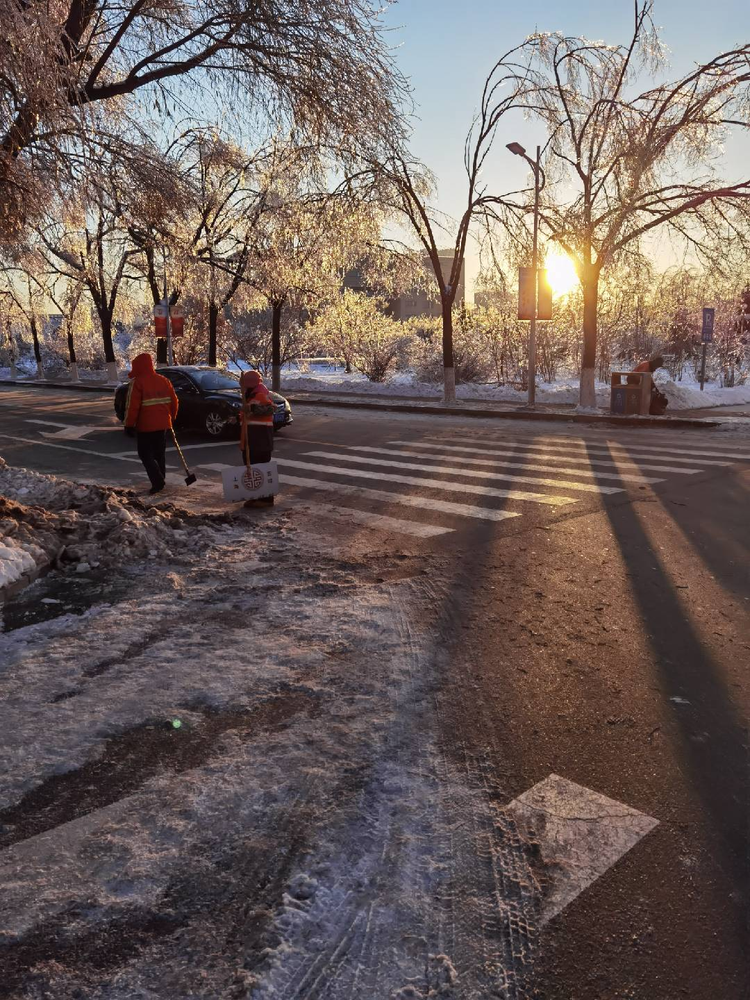
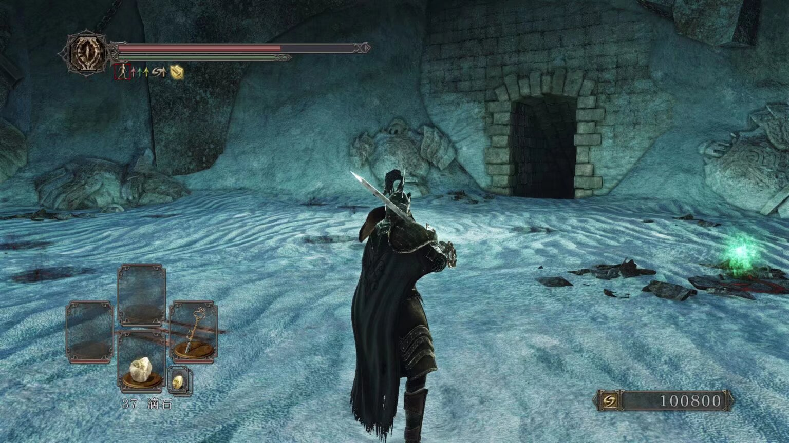

提笔时才发现闲时记录的照片已经不在现在的手机上了, 所幸仍未遗失.
全套的电子设备经过了一轮换代, 我过去四年的生活却宛如一张白纸, 亦不知我是否从未改变.

在长春迎接我的第一场雪就伴随着一场冻雨, 漫天飞雪带来晶莹剔透, 太阳光在琉璃世界中折射出五彩的光芒.
这梦幻的场景或许这一生都不会在重复了, 因为疫情以及我自己性格上的原因我几乎从未出过校门,
但我想这样的景色无法通过刻意追寻求得. 这是我前1/4的人生里最美的一刻, 尽管它有着扑在脸上如烈火焚烧的寒风.

凭着最初半年的努力顺利进入了唐班, 提前预订保研资格, 随之而来的却是迷惘.
离散数学出分的那个下午, 窗外大雨滂沱, 看着不到3的绩点愣在屏幕前不知所措;
得知操作系统课设没有满绩的那个夜晚, 在V3里麻木的操纵着普鲁士的市场, 乃至萌生了放弃保研的想法.
没有参加竞赛, 尝试参与科研也都是浅尝辄止, 我得过且过的度过自己的学术生涯.
不过窝在寝室里摆烂的日子我也看到了高纬度的冬季天空, 
这夕阳刚刚落下时的蓝调色彩总是会给焦虑的我带来一点宽慰. 

如开头所言我的本科四年犹如白纸, 白的就像口罩与防护服.
2022年3月13日, 星期日, 睁开眼就得知封寝的消息.
除了寝室之外禁止踏足任何地点, 几步之遥的厕所也必须戴上口罩, 没有独卫使得整整一个月不能够洗澡.
前半段的餐食免费供应, 后半段需要每天自己预订, 口味重复寡淡且没有一份多余,
忘记订饭的那天靠着两包榨菜度过一整天, 晚上躺在床上肚痛难忍.
大白每天上门核酸, 麻木的开门捅嗓子, 在麻木的回到床上过着看不到头的日子.
2022年5月8日, 早上六点就来到人满为患的机场, 排到九点队伍都没有前进1/10,
靠着工作人员开放的加急通道成功回到家乡, 逃离这地狱一样的景象.
经历了如此严厉的封控, 疫情却不见好转, 下学期回来后对核酸的要求更是变本加厉.
我不想苛责任何人, 包括到现在都被调侃的许婧文同学, 大家都是照章办事.
不像上海封城, 这件事情早已被遗忘, 尽管它们的烈度不相上下.
希望我所说的这些未来不会再发生, 希望世界和平.

闲暇之余沉迷3D势的VUP A-SOUL, 尤其是珈乐Carol,
她510毕业风波之后第一次有失恋的感觉, 后续的撕皮直播也断断续续看了一年.
当然, 也是因此机缘巧合了解了计算机图形学这一领域.
靠着*Introduction to 3D Game Programming with DirectX® 12*以及*Real-Time Rendering 4th Edition*
两本书不断迭代自己的carol-engine, 现在想来这是本科生活里唯一能影响我未来人生的经历.
靠着这股热爱联系了浙大CAD&CG实验室的老师, 进入了对于985学校来说相对容易的浙大软院, 
现在在图形相关的岗位上实习, 也算对的起每天打开Visual Studio 2022坐着写一整天C++和HLSL的自己了.

我的保研之路并没有多坎坷, 很早就选好导师并且开始给老板干活, 从一开始就想好要all in浙软.
不过真的到了夏令营和预推免还是会很紧张, 毕竟政策随时在变化.
当时夏令营的内容是两周复现NeRF并优化, 有一点CG与DL基础的我并没有遇到很多困难,
了解了NeRF的体渲染实现方式后比较顺利的完成了Instant-NGP的复现,
并与Mip-NeRF 360的distortion loss结合以实现unbound场景的降噪.
做项目的时候顺手用python给NeRF写了一个实时渲染器, 不过性能不怎么样, 也没空再优化了.
浙软夏令营的优营只会给一个预推免的入场券, 后面真的快要预推免的时候整个人焦虑的不行,
每天疯狂的复习408, 刷PAT题库, 好在机试的成绩比我预想的高很多,
面试主要问了计网, 数据库以及carol-engine的项目, 回答的很流利, 最后推免排名十分靠前.
说真的高考远没有保研结束的那一刻舒畅, 大概是因为保研时对于结束后的生活有了明确的规划:
学习NeoVim, 双十一组一台光追性能强劲的电脑, 通关往日之影.
最后这些规划也都一一实现, 活着还是很幸福的.

说是实习, 其实是在导师公司, 相当于提前给老板打工了. 这里最神奇的是开发系统是Arch Linux,
尽管大二大三有着使用Ubuntu与Deepin的基础, 但把Linux作为工作环境还是第一次.
接触Arch就很难不被它高度自定义化的特性所感染, 双十一装机后我也在自己的电脑上安装了Arch,
更进一步的我开始自定义桌面环境, 用Hyprland, ElKowars wacky widges, rofi与dunst搭起一套桌面环境,
成为一名Unix Ricer, 现在这套配置已经迁移到了NixOS上.
Rice确实给人一种光阴虚度的感觉, 但我作为一位程序员,
去接触不同的开源软件并了解它们的设计, 尝试掌控自己的电脑, 这是很有意义的.

 
中学时家里配置最高的电脑是拥有GT 630M的笔记本,
到了2016年甚至魔兽世界7.0最低画质也只有个位数帧数了.
我在初一的寒假拥有了PS4, 我的第一台游戏主机, 也正因此我更偏爱主机游戏.
上了大学后的我拥有了游戏自由, 
我在八十稻羽驱散天之狭雾, 在辰巳人工岛静静倾听神木秋成的粉色鳄鱼,
在初始之火的火炉继承乌薪王的传火遗志, 在黑雾之塔的底部与烟之骑士雷姆鏖战四天四夜,
在1992年的洛圣都的K-DST电台里听着*Young Turks*, 在黑门34年重回艾泽拉斯...
我在大学里完成了游戏生涯补完计划, 以至于有些电子ED.
最近对JRPG颇有兴趣, 618靠着工资买了一台Steam Deck, 希望未来三年能完成JRPG的补完.

> 多年以后,\
> 面对倒下的烟之骑士,\
> 他会回想起在天空的渔村\
> 第一次遇见科斯孤儿的\
> 那个遥远的下午.

文学作品的阅读量远不如高中了, 毕竟无需再为作文而刻意去搜罗素材,
仔细想来其实只读了英语课上了解到的乔伊斯的*都柏林人*这一本短篇集,
捧着实体书读着都柏林众生的故事会给我一种莫名的温馨感.
之后也试着去读乔伊斯的*尤利西斯*, 很遗憾没有对意识流的品鉴能力,
几页过后就草草收场. 文学造诣一天天倒退, 对ACGN作品的兴趣却一天天的浓郁,
尤其是大四开始实习之后, 架不住公司里浓郁的二次元氛围被成功传染.
不过本科期间最令我动容的作品是2022年10月的*赛博朋克: 边缘行者*,
作为游戏预购玩家的我对2077的剧情并没有多感冒,
*I really want to stay at you house*也只是体温电台里纪念威尔斯的一首歌,
但扳机社在边缘行者里悲剧般的描写让我在之后的两个星期里不断循环着它,
犹如一个赛博精神病, 为大卫与露西的爱情而感伤.
之后再去玩往日之影时竟被追求自由的百灵鸟所打动,
是CDPR的剧本进步了, 还是我的脑子变了呢?
二次元很煞笔, 我也是.

> 子弹杯里伏特加加冰,\
> 兑小可可乐.\
> 生得伟大,\
> 死的光荣.

写到这里也该有个结尾了, 本以为会是对废物一样的自己的嘲讽,
总结下来却发现并没有太多的失魂落魄.
祝愿我的未来三年一帆风顺, 祝愿我的人生前程似锦.
