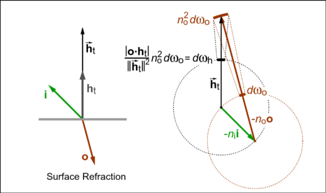



pbrt将反射分为以下四类: 漫反射, 光滑镜面反射, 完美镜面反射, 回溯反射. 反射分布方程可以被分为各向同性与各向异性的, 若将物体旋转时在各个角度上具有相同的反射结果即位各向同性, 反之则为各向异性.

## BSDF表示

pbrt中`BxDF`接口代表特定种类表面散射的实现, `BSDF`则是围绕`BxDF`指针做一层封装并提供额外功能.

### 几何设置与约定

pbrt中法线计算发生在由表面的切线, 副切线与法线组成的坐标系中, 分别与\\(x,y,z\\)轴对齐. pbrt中光线入射方向与观察方向都会被归一化并方向朝外, 法线也始终朝外. 着色所用的坐标系很可能与相交所用的不同, 这便于实现法线映射等效果.

### BxDF接口

单独的BRDF与BTDF方法都定义在`BxDF`接口中.

```c++
class BxDF
    : public TaggedPointer<DiffuseTransmissionBxDF, DiffuseBxDF, CoatedDiffuseBxDF,
                           CoatedConductorBxDF, DielectricBxDF, ThinDielectricBxDF,
                           HairBxDF, MeasuredBxDF, ConductorBxDF, NormalizedFresnelBxDF> {
  public:
    // BxDF Interface
    PBRT_CPU_GPU inline BxDFFlags Flags() const;

    using TaggedPointer::TaggedPointer;

    std::string ToString() const;

    PBRT_CPU_GPU inline SampledSpectrum f(Vector3f wo, Vector3f wi,
                                          TransportMode mode) const;

    PBRT_CPU_GPU inline pstd::optional<BSDFSample> Sample_f(
        Vector3f wo, Float uc, Point2f u, TransportMode mode = TransportMode::Radiance,
        BxDFReflTransFlags sampleFlags = BxDFReflTransFlags::All) const;

    PBRT_CPU_GPU inline Float PDF(
        Vector3f wo, Vector3f wi, TransportMode mode,
        BxDFReflTransFlags sampleFlags = BxDFReflTransFlags::All) const;

    PBRT_CPU_GPU
    SampledSpectrum rho(Vector3f wo, pstd::span<const Float> uc,
                        pstd::span<const Point2f> u2) const;
    SampledSpectrum rho(pstd::span<const Point2f> u1, pstd::span<const Float> uc2,
                        pstd::span<const Point2f> u2) const;

    PBRT_CPU_GPU inline void Regularize();
};
```

`Flags`方法用于返回上文所述的材质类型以及区分反射与透射, 部分光线传播算法会通过该返回值决定行为.

```c++
enum BxDFFlags {
    Unset = 0,
    Reflection = 1 << 0,
    Transmission = 1 << 1,
    Diffuse = 1 << 2,
    Glossy = 1 << 3,
    Specular = 1 << 4,
    // Composite _BxDFFlags_ definitions
    DiffuseReflection = Diffuse | Reflection,
    DiffuseTransmission = Diffuse | Transmission,
    GlossyReflection = Glossy | Reflection,
    GlossyTransmission = Glossy | Transmission,
    SpecularReflection = Specular | Reflection,
    SpecularTransmission = Specular | Transmission,
    All = Diffuse | Glossy | Specular | Reflection | Transmission

};
```

`BxDF`的关键方法是`f`, 它根据方向返回BxDF的值, 方向需要位于前文所述的材质的本地空间中. `BxDF`接口认为不同波长的光是被解耦的, 某个波长上的能量不会被反射到不同的波长上, 因此`f`的返回值通过`SampledSpectrum`来表达. 荧光材质会在不同的波长间重新分布能量, 需要返回\\(n \times n\\)的矩阵来表示\\(n\\)个光谱样本之间的转移. `BxDF`的构造函数以及各种方法都没有`SampledSpectrum`中具体某个波长的信息, 这是不需要的. `TransportMode`用于表示出射方向是对着相机还是对着光源, 不对称散射会用到这一特性.

```c++
PBRT_CPU_GPU inline SampledSpectrum BxDF::f(Vector3f wo, Vector3f wi, TransportMode mode) const {
    auto f = [&](auto ptr) -> SampledSpectrum { return ptr->f(wo, wi, mode); };
    return Dispatch(f);
}
```

`BxDF`还需要提供用于重要性抽样的方法, `Sample_f`用于实现这一任务. 由于光线路径是逆向构造的, 因此这里出射方向作为参数, 采样得到的入射方向. 参数中的`uc`与`u`用于实现一维与二维的采样, 通常`uc`用于选择反射或透射, `u`用于选择方向.

```c++
PBRT_CPU_GPU inline pstd::optional<BSDFSample> BxDF::Sample_f(Vector3f wo, Float uc, Point2f u,
                                                 TransportMode mode,
                                                 BxDFReflTransFlags sampleFlags) const {
    auto sample_f = [&](auto ptr) -> pstd::optional<BSDFSample> {
        return ptr->Sample_f(wo, uc, u, mode, sampleFlags);
    };
    return Dispatch(sample_f);
}
```

用户可以通过`sampleFlags`参数限制采样结果为透射或反射, 像在不透明表面采样透射样本的不合法采样会导致采样失效.

```c++
enum class BxDFReflTransFlags {
    Unset = 0,
    Reflection = 1 << 0,
    Transmission = 1 << 1,
    All = Reflection | Transmission
};
```

若采样成功, BSDF的值, 入射方向, 分布密度以及对应的`flags`会被返回, 这里返回的`wi`位于本地空间中, 在`BSDF`中会转到渲染空间.

```c++
struct BSDFSample {
    // BSDFSample Public Methods
    BSDFSample() = default;
    PBRT_CPU_GPU
    BSDFSample(SampledSpectrum f, Vector3f wi, Float pdf, BxDFFlags flags, Float eta = 1,
               bool pdfIsProportional = false)
        : f(f),
          wi(wi),
          pdf(pdf),
          flags(flags),
          eta(eta),
          pdfIsProportional(pdfIsProportional) {}

    PBRT_CPU_GPU
    bool IsReflection() const { return pbrt::IsReflective(flags); }
    PBRT_CPU_GPU
    bool IsTransmission() const { return pbrt::IsTransmissive(flags); }
    PBRT_CPU_GPU
    bool IsDiffuse() const { return pbrt::IsDiffuse(flags); }
    PBRT_CPU_GPU
    bool IsGlossy() const { return pbrt::IsGlossy(flags); }
    PBRT_CPU_GPU
    bool IsSpecular() const { return pbrt::IsSpecular(flags); }

    std::string ToString() const;
    SampledSpectrum f;
    Vector3f wi;
    Float pdf = 0;
    BxDFFlags flags;
    Float eta = 1;
    bool pdfIsProportional = false;
};
```

### 半球反射

`rho`方法的两种重载分别用于计算第四章所介绍的半球-方向反射量与半球-半球反射量, 样本数量由调用者决定.

```c++
PBRT_CPU_GPU SampledSpectrum BxDF::rho(Vector3f wo, pstd::span<const Float> uc,
                          pstd::span<const Point2f> u2) const {
    if (wo.z == 0)
        return {};
    SampledSpectrum r(0.);
    DCHECK_EQ(uc.size(), u2.size());
    for (size_t i = 0; i < uc.size(); ++i) {
        // Compute estimate of $\rho_\roman{hd}$
        pstd::optional<BSDFSample> bs = Sample_f(wo, uc[i], u2[i]);
        if (bs && bs->pdf > 0)
            r += bs->f * AbsCosTheta(bs->wi) / bs->pdf;
    }
    return r / uc.size();
}

SampledSpectrum BxDF::rho(pstd::span<const Point2f> u1, pstd::span<const Float> uc,
                          pstd::span<const Point2f> u2) const {
    DCHECK_EQ(uc.size(), u1.size());
    DCHECK_EQ(u1.size(), u2.size());
    SampledSpectrum r(0.f);
    for (size_t i = 0; i < uc.size(); ++i) {
        // Compute estimate of $\rho_\roman{hh}$
        Vector3f wo = SampleUniformHemisphere(u1[i]);
        if (wo.z == 0)
            continue;
        Float pdfo = UniformHemispherePDF();
        pstd::optional<BSDFSample> bs = Sample_f(wo, uc[i], u2[i]);
        if (bs && bs->pdf > 0)
            r += bs->f * AbsCosTheta(bs->wi) * AbsCosTheta(wo) / (pdfo * bs->pdf);
    }
    return r / (Pi * uc.size());
}
```

### BSDF中的Delta分布

Delta分布主要用于完美镜面反射, 但是对于`Sample_f`与`PDF`方法, 返回Delta函数对应的无穷大密度在c++中是无法得到正确的渲染结果的. 对于`Sample_f`方法, 将Delta函数从PDF与BSDF分离, 可以发现Delta函数会被抵消, 由于PDF与Delta函数一致, 因此PDF设置为1即可. 对于`PDF`方法, 它的返回值为0, 因为恰好位于Delta函数对应的反射方向的概率过小.

$$
\begin{equation}
\frac{f_r(p, \omega_o, \omega_i)}{p(\omega_i)} = \frac{\delta(\omega' - \omega_i)f_r^{\text{rem}}(p, \omega_o, \omega_i)}{\delta(\omega' - \omega_i)p^{\text{rem}(\omega_i)}} = \frac{f_r^{\text{rem}}(p, \omega_o, \omega_i)}{p^{\text{rem}(\omega_i)}}
\end{equation}
$$

### BSDF类

`BSDF`主要用于处理从材质本地空间到渲染空间的转换. `BSDF`的构造函数会传入几何法线, 着色法线以及切线, `shadingFrame`用于存储着色所用的坐标系以及处理与渲染空间之间的转换.

```c++
BSDF() = default;
PBRT_CPU_GPU
BSDF(Normal3f ns, Vector3f dpdus, BxDF bxdf)
    : bxdf(bxdf), shadingFrame(Frame::FromXZ(Normalize(dpdus), Vector3f(ns))) {}
```

`BSDF`的`f`方法用于封装`BxDF`中的对应方法, 其中的模板版本用于在用户已知内部`BxDF`类型的情况下直接调用它的`f`方法, 这用于在GPU上避免pbrt中的动态方法分发.

```c++
PBRT_CPU_GPU
SampledSpectrum f(Vector3f woRender, Vector3f wiRender,
                    TransportMode mode = TransportMode::Radiance) const {
    Vector3f wi = RenderToLocal(wiRender), wo = RenderToLocal(woRender);
    if (wo.z == 0)
        return {};
    return bxdf.f(wo, wi, mode);
}

template <typename BxDF>
PBRT_CPU_GPU SampledSpectrum f(Vector3f woRender, Vector3f wiRender,
                                TransportMode mode = TransportMode::Radiance) const {
    Vector3f wi = RenderToLocal(wiRender), wo = RenderToLocal(woRender);
    if (wo.z == 0)
        return {};
    const BxDF *specificBxDF = bxdf.CastOrNullptr<BxDF>();
    return specificBxDF->f(wo, wi, mode);
}
```

`BSDF`的`Sample_f`会通过`std::optional`处理采样失效的情况.

```c++
PBRT_CPU_GPU
pstd::optional<BSDFSample> Sample_f(
    Vector3f woRender, Float u, Point2f u2,
    TransportMode mode = TransportMode::Radiance,
    BxDFReflTransFlags sampleFlags = BxDFReflTransFlags::All) const {
    Vector3f wo = RenderToLocal(woRender);
    if (wo.z == 0 || !(bxdf.Flags() & sampleFlags))
        return {};
    // Sample _bxdf_ and return _BSDFSample_
    pstd::optional<BSDFSample> bs = bxdf.Sample_f(wo, u, u2, mode, sampleFlags);
    if (bs)
        DCHECK_GE(bs->pdf, 0);
    if (!bs || !bs->f || bs->pdf == 0 || bs->wi.z == 0)
        return {};
    PBRT_DBG("For wo = (%f, %f, %f), ns %f %f %f sampled f = %f %f %f %f, pdf = %f, "
                "ratio[0] = %f wi = (%f, %f, %f)\n",
                wo.x, wo.y, wo.z, shadingFrame.z.x, shadingFrame.z.y, shadingFrame.z.z,
                bs->f[0], bs->f[1], bs->f[2], bs->f[3], bs->pdf,
                (bs->pdf > 0) ? (bs->f[0] / bs->pdf) : 0, bs->wi.x, bs->wi.y, bs->wi.z);
    bs->wi = LocalToRender(bs->wi);
    return bs;
}
```

## 漫反射

Lambertian反射模型是最简单的BRDF之一, 它表达了将入射光线均匀的反射到各个方向的完美漫反射. 大部分角度下Lambertian模型都可以很好的表达漫反射, 但是在与法线接近垂直的掠射角下镜面反射会导致明显的偏差.

Lambertian反射的表达式如下, 其中的\\(\pi\\)来自于积分得到的反射值. 在实时渲染中, 材质的反照率通常会预先乘上\\(\pi\\), 这避免了耗时的除法操作.

$$
\begin{equation}
\int_\omega f_r(p, \omega_o, \omega_i) \cos\theta d\omega = \int_0^{2\pi}\int_0^{\frac{\pi}{2}} \frac{R}{\pi} \cos\theta \sin\theta d\theta d\phi = R
\end{equation}
$$

pbrt在采样Lambertian时会将\\(\cos\\)项考虑进pdf中, 这使得分布不再均匀, 但能通过重要性抽样获得更好的渲染结果.

```c++
// Sample cosine-weighted hemisphere to compute _wi_ and _pdf_
Vector3f wi = SampleCosineHemisphere(u);
if (wo.z < 0)
    wi.z *= -1;
Float pdf = CosineHemispherePDF(AbsCosTheta(wi));
```

### 圆盘采样

对极坐标\\(r,\theta\\)分别做重要性抽样会导致样本集中在圆盘中央, 因为虽然距离圆心距离的分布是均匀的, 由于不同半径下周长不同, 外侧点的分布会减少.

为了保证样本点在面积上均匀分布, 需要满足\\(p(x,y)=\frac{1}{\pi}\\), 使用Jacobi转为极坐标后可得\\(p(r,\theta)=\frac{r}{\pi}\\). 此时可以计算出如下PDF.

$$
\begin{equation}
\begin{aligned}
p(r)&=\int_0^{2\pi}p(r,\theta)d\theta=2r\\\\
p(\theta|r)&=\frac{p(r,\theta)}{p(r)}=\frac{1}{2\pi}
\end{aligned}
\end{equation}
$$

根据重要性抽样得到的结果如下, 此时根据Jacobian可得\\(drd\theta=\frac{\pi}{\sqrt{x}}dxdy\\), 均匀采样结果映射为圆盘采样结果时所占的面积并不均匀, 越靠近圆盘边缘所占面积越狭窄.

$$
\begin{equation}
\begin{aligned}
r&=\sqrt{\epsilon_1}\\\\
\theta&=2\pi\epsilon_2
\end{aligned}
\end{equation}
$$

Shirley-Chiu方法可以解决这一问题, 根据Cartesian轴及\\(y=x,y=-x\\)将\\([-1,1]\\)空间分为八个象限, 每个象限根据\\(\max(x,y\\))选出的轴是一致的, 长轴选取\\(a\\)点, 短轴选取\\(b\\)点, 需保证该\\(\frac{ab}{2}\\)面积的区域内的采样点在Cartesian及极坐标下所占面积成常数关系. 由于圆弧面积为\\(\frac{\theta r^2}{2}\\), 如下表达式可满足上述条件, 在极坐标中占的面积为\\(\frac{\pi ab}{8}\\), 看图片会更直观.


$$
\begin{equation}
\begin{aligned}
r&=
\begin{cases}
x & |x|>|y|\\\\
y & |x| \le |y|
\end{cases}\\\\
\theta&=
\begin{cases}
\frac{\pi}{4}\frac{y}{x} & |x| > |y|\\\\
\frac{\pi}{2} - \frac{x}{y} & |x| \le |y|
\end{cases}
\end{aligned}
\end{equation}
$$

此时Jacobian行列式满足如下关系, 因此\\(p(r,\theta)=|J|^{-1}p(u,v)=|J|^{-1}\frac{1}{4}=\frac{r}{\pi}\\).

$$
\begin{equation}
\begin{aligned}
|J|&=
\begin{cases}
\frac{\pi}{4x}=\frac{\pi}{4r} & |x|>|y|\\\\
\frac{\pi}{4y}=\frac{\pi}{4r} & |x|\le|y|
\end{cases}
\end{aligned}
\end{equation}
$$

### 余弦加权半球采样

渲染方程中有余弦项, 将它与BSDF一起做重要性抽样可以有效的考虑余弦的影响, 例如减小与法线夹角较大的光线被采样到的概率. 令\\(p(\omega)=c\cos\theta\\), 此时可以得到如下关系.

$$
\begin{equation}
\begin{aligned}
&\int_\Theta p(\omega)d\omega=1\\\\
&\int_0^{2\pi}\int_0^{\frac{\pi}{2}}c\cos\theta\sin\theta d\theta d\phi=1\\\
&c=\frac{1}{\pi}\\\\
&p(\theta,\phi)=\frac{1}{\pi}\cos\theta\sin\theta
\end{aligned}
\end{equation}
$$

Malley方法通过将均匀圆盘采样的结果投影到半球上实现重要性抽样. 由于此时\\(r=\sin\theta\\),将\\(r,\phi\\)转为\\(\theta,\phi\\)的Jacobian如下, 由此可得\\(p(\theta,\phi)=p(r,\phi)\cos\theta=\frac{\sin\theta\cos\theta}{\pi}\\), 满足重要性抽样的要求.


$$
\begin{equation}
\begin{aligned}
|J|=\begin{vmatrix}
\frac{\partial r}{\partial \theta} & \frac{\partial r}{\partial \phi}\\\\
\frac{\partial \phi}{\partial \theta} & \frac{\partial \phi}{\partial \phi}
\end{vmatrix}
=\begin{vmatrix}
\cos\theta & 0\\\\
0 & 1
\end{vmatrix}=\cos\theta
\end{aligned}
\end{equation}
$$

## 镜面反射与透射

镜面反射只会将光线反射到某个方向集合中, 本节主要关注完美镜面反射, 微表面理论对反射结果的影响会在后面讨论.

### 物理原理

pbrt主要关注几何光学, 在波长远小于物体尺寸时这是可行的, 但对光的本质的探究也是必要的. 根据电磁学的定义光是电磁场的振荡, pbrt只关注其中电场的部分即电子的运动, 当光与表面接触时会刺激表面上的电子使其剧烈振荡, 移动的电子会导致电场中振荡的叠加.

依据电磁学理论, 物质可以分为绝缘体, 导体与半导体. 绝缘体中电子不会脱离原子; 导体中电子可以自由移动, 但移动过程中会有能量衰减, 通常完全吸收会发生在距离表面小于0.1微米处; 半导体兼顾二者的特性, 例如硅在可见光内具有金属特性, 在红外光中则具有透明特性.

### 折射率

由光所激发的电子产生的振荡通常会比原本的振荡的速度要小, 速度减小的程度被称为折射率(index of refraction, IOR), 它通过真空光速与当前材质中的光速的比值来定义, 通常在1.0~2.5之间, 同时光的波长也会影响IOR. IOR的突变会导致反射率的增加, IOR的变化是我们能观察到物体的原因.

### 镜面反射法则

令入射光线方向为\\(\omega_i\\)(如上文所述, 方向是朝外的, 并非光线的传播方向), 完美反射的方向如下.

$$
\begin{equation}
\omega_r = -\omega_i + 2(\bold{n} \cdot \omega_i)\bold{n}
\end{equation}
$$

### Snell定律

Snell定律描述了入射光线与折射光线在方向上的关系, 这可以通过Fermat原理推导得到, 即光的传播路径是耗时最小的路径, 通过求极值即可证明. 从Snell定律可以看出折射方向取决于IOR的比值即相对IOR, 后文中通过\\(\eta\\)表示该值.

$$
\begin{equation}
\begin{aligned}
\eta_i \sin\theta_i &= \eta_t \sin\theta_t\\\\
\phi_t &= \phi_i + \pi
\end{aligned}
\end{equation}
$$

经过不同介质后, 由于光的不同波长的部分具有不同的IOR, 这导致传播方向不同, 这被称为散射, 通常会表现为经过介质后产生彩虹状的光锥.

利用Snell定律可以按如下方式表示折射光线. 当光线从物体内部发出时, 由于法线朝外, \\(\omega_i \cdot \bold{n}\\)小于0, 需要对代码做适当调整.

$$
\begin{equation}
\omega_t = -\frac{\omega_i}{\eta} + \left[ \frac{\omega_i \cdot \bold{n}}{\eta} - \cos\theta_t \right] \bold{n}
\end{equation}
$$

当光线穿过光学密度更小(折射后的介质的IOR较小)时, 当入射天顶角超过\\(\theta_c = \sin^{-1}(\eta^{-1})\\)时折射天顶角会超过\\(90^{\circ}\\), 此时光线会完全反射.

### Fresnel方程

Fresnel方程描述了光线折射与反射的量, 它是Maxwell方程在光滑平面上的解.

将光线分解为相对于表面的垂直与水平偏振, 它们因反射而产生的振幅的变化是不同的.

$$
\begin{equation}
\begin{aligned}
r_{||} &= \frac{E_r^{||}}{E_i^{||}} &= \frac{\eta_t \cos\theta_i - \eta_i \cos\theta_t}{\eta_t \cos\theta_i + \eta_i \cos\theta_t} &= \frac{\eta \cos\theta_i - \cos\theta_t}{\eta \cos\theta_i + \cos\theta_t}\\\\
r_{\perp} &= \frac{E_r^{\perp}}{E_i^{\perp}} &= \frac{\eta_i \cos\theta_i - \eta_t \cos\theta_t}{\eta_i \cos\theta_i + \eta_t \cos\theta_t} &= \frac{\cos\theta_i - \eta \cos\theta_t}{\cos\theta_i + \eta \cos\theta_t}
\end{aligned}
\end{equation}
$$

电磁学关注的是反射波的振幅与相位, 而pbrt的几何光学中更关注光线所携带的功率, 这可以通过振幅的平方来表示. 若入射光是无偏振的即含有等量的水平与垂直偏振, 此时反射功率为水平与垂直反射功率的平均值, 即位Fresnel反射率.

$$
\begin{equation}
F_r = \frac{1}{2}(r_{||}^2 + r_{\perp}^2)
\end{equation}
$$

实时渲染中通常使用Schlick近似.

$$
\begin{equation}
\begin{aligned}
F_r &= F_{r_0}+(1-F_{r_0})(1-\cos\theta_i)^5\\\\
F_{r_0} &= \left(\frac{\eta_i - \eta_t}{\eta_i + \eta_t}\right)^2
\end{aligned}
\end{equation}
$$

### 导体Fresnel方程

导体的IOR需要用复数表示, 实部描述光线速度的减小, 虚部描述光线在材质内传播时的衰减. 尽管渲染中不需要考虑导体折射的部分, 它所带来的能量衰减也会影响反射. 复数的2范数为实部与虚部和的平方, 此时即可泛化上述Fresnel反射率的计算.

## 导体BRDF

本节描述的是从光从绝缘体介质中接触导体表面时的BRDF, 只考虑光滑的情况. 光滑导体只将光线返回到一个反向, 反射光线的辐亮度由Fresnel反射率决定, 因此BRDF如下.

$$
\begin{equation}
f_r(p, \omega_o, \omega_i) = F_r(\omega_r) \frac{\delta(\omega_i - \omega_r)}{|\cos\theta_r|}
\end{equation}
$$

## 绝缘体BSDF

pbrt在选择采样反射或透射时, 根据Fresnel反射率以及用户设置的Flags来决定. 由于只考虑光滑表面, BRDF和BTDF与上一节的导体BRDF都是相同的.

### 薄绝缘体BSDF

pbrt通过`ThinDielectricBxDF`模拟光线穿过薄绝缘体平行的内外表面的现象, 由Fresnel反射率的定义可知, 若交换表面两侧的介质结果是不变的, 因此在薄导体内部多次反射后的总反射率如下.

$$
\begin{equation}
R' = R + TRT + TRRRT + \cdots = R + \frac{T^2R}{1-R^2}
\end{equation}
$$

### 非对称散射与折射

BRDF都是对称的, 即入射与反射方向可以交换, 但BTDF不是, 因为IOR的变化会导致折射后光线范围的变化, 为保持能量守恒光线的辐亮度不再保持一致. 根据能量守恒我们可以认为\\(d^2\phi_o = d^2\phi_i\\), 结合辐亮度的定义与Snell定律可以推导出如下的关系. 由于路径追踪实际上为光线传播的逆过程, 在折射时需要考虑非对称折射的现象.

$$
\begin{equation}
\eta_o^2 f_t(p, \omega_o, \omega_i) = \eta_i^2 f_t(p, \omega_i, \omega_o)
\end{equation}
$$

## 微表面理论

大部分物体表面在微观上是粗糙的, 这可以通过微表面理论模拟, 这避免了对建模精度的要求, 且更适用于Monte Carlo.

### 法线分布函数

微表面分布主要定义了法线的分布, 由于光源与观察者都与表面相距较远, 这种概率表示是可行的. 宏表面与微表面所占的面积关系如下, 即微表面沿宏观法线投影的面积与宏表面面积相等.

$$
\begin{equation}
\int_{dA_\mu}(\omega_m(p) \cdot \bold{n}) dp = \int_{dA} dp
\end{equation}
$$

将所有具有某个方向的法线的微表面在宏表面上的相对投影面积定义为法线分布函数, 此时可以得到法线分布函数的归一化性质.

$$
\begin{equation}
\int_\Omega D(\omega_m)(\omega_m \cdot \bold{n}) d\omega_m = \int_\Omega D(\omega_m) \cos\theta_m d\omega_m = 1
\end{equation}
$$

若转为斜率分布, 可以得到如下关系.

$$
\begin{equation}
\int_{-\infty}^{\infty} \int_{-\infty}^{\infty} P^{22}(x_{\tilde{m}},y_{\tilde{m}}) dx_{\tilde{m}} dy_{\tilde{m}}=1
\end{equation}
$$

根据平面的定义\\(x_mx+y_my+z_mz+c=0\\), 法线与斜率具有如下的关系.

$$
\begin{equation}
\begin{aligned}
(x_{\tilde{m}},y_{\tilde{m}})&=(-\frac{x_m}{z_m},-\frac{y_m}{z_m})=-\tan\theta_m(\cos\phi_m,\sin\phi_m)\\\\
(x_m, y_m, z_m)&=\frac{(-x_{\tilde{m}},-y_{\tilde{m}},1)}{\sqrt{x_{\tilde{m}}^2+y_{\tilde{m}}^2+1}}=\frac{(-x_{\tilde{m}},-y_{\tilde{m}},1)}{\cos\theta_m}
\end{aligned}
\end{equation}
$$

Jacobi行列式的计算结果如下.

$$
\begin{equation}
dx_{\tilde{m}}dy_{\tilde{m}}=\frac{\sin\theta}{\cos^3\theta}d\theta d\phi
\end{equation}
$$

此时可以得到法线分布函数与斜率分布函数的转换关系.

$$
\begin{equation}
D(\omega_m) = \frac{P^{22}(x_{\tilde{m}},y_{\tilde{m}}) dx_{\tilde{m}} dy_{\tilde{m}}}{\cos\theta \sin\theta d\theta d\phi} = \frac{P^{22}(x_{\tilde{m}},y_{\tilde{m}})}{\cos^4\theta}
\end{equation}
$$

若法线分布函数为形状无关的, 即修改粗糙度等价于对法线分布函数进行拉伸, 则其斜率分布需要满足如下形式.

$$
\begin{equation}
\begin{aligned}
P^{22}(x_{\tilde{m}},y_{\tilde{m}})
&=\frac{1}{\alpha_x\alpha_y}f(\sqrt{\frac{x_{\tilde{m}^2}}{\alpha_x^2} + \frac{y_{\tilde{m}^2}}{\alpha_y^2}})\\\\
&=\frac{1}{\alpha_x\alpha_y}f(\tan\theta_m\sqrt{\frac{\cos^2\phi_m}{\alpha_x^2} + \frac{\sin^2\phi_m}{\alpha_y^2}})
\end{aligned}
\end{equation}
$$

对于渲染任务最常用的GGX法线分布函数定义如下.

$$
\begin{equation}
\begin{aligned}
P^{22}(x_{\tilde{m}},y_{\tilde{m}}) &= \frac{1}{\pi\alpha_x\alpha_y(1+\frac{x_{\tilde{m}^2}}{\alpha_x^2} + \frac{y_{\tilde{m}^2}}{\alpha_y^2})^2}\\\\
D(\omega_m) &= \frac{1}{\pi\alpha_x\alpha_y\cos^4\theta_m(1+\tan^2\theta_m(\frac{\cos^2\phi_m}{\alpha_x^2} + \frac{\sin^2\phi_m}{\alpha_y^2}))^2}
\end{aligned}
\end{equation}
$$

### 遮蔽函数

微表面可能会被遮挡, 需要通过遮蔽函数来表示某个方向上被遮蔽的比率.

$$
\begin{equation}
\int_\Omega D(\omega_m)G_1(\omega,\omega_m)\max(0,\omega\cdot\omega_m)d\omega_m=\omega\cdot\bold{n}=\cos\theta
\end{equation}
$$

Smith遮蔽函数认为法线与高度是独立的, 即微表面类似于一个一个浮动的小片段, 此时可以将遮蔽函数分解为局部遮蔽与全部遮蔽, 局部遮蔽只需要法线可见, 此时遮蔽函数不再依赖于微表面法线. 不失一般性, 令表面为各向同性的, 法线为局部空间中的\\((0,0,1)\\), 视线沿\\(x\\)轴为\\((\sin\theta, 0, \cos\theta)\\), 已知由于对称性\\(\int_{-\infty}^{\infty}x_{\tilde{m}}P^{2-}(x_{\tilde{m}})dx_{\tilde{m}}=0\\),\\(\int_{-\infty}^{\infty}P^{2-}(x_{\tilde{m}})dx_{\tilde{m}}=1\\),此时可以得到如下结果.

$$
\begin{equation}
\begin{aligned}
G_1(\omega)
&=\frac{\cos\theta}{\int_\Omega D(\omega_m)\max(0,\omega\cdot\omega_m)d\omega_m}\\\\
&=\frac{\cos\theta}{\int_\Omega D(\omega_m)\cos\theta_m\frac{\max(0,\omega\cdot\omega_m)}{\cos\theta_m}d\omega_m}\\\\
&=\frac{\cos\theta}{\int_{-\infty}^{\infty}\int_{-\infty}^{\infty}P^{22}(x_{\tilde{m}},y_{\tilde{m}}) \max(0, \frac{-x_{\tilde{m}}\sin\theta + \cos\theta}{\cos\theta_m})\cos\theta_m dx_{\tilde{m}} dy_{\tilde{m}}}\\\\
&=\frac{\cos\theta}{\int_{-\infty}^{\infty}\int_{-\infty}^{\cot\theta}P^{22}(x_{\tilde{m}},y_{\tilde{m}}) (-x_{\tilde{m}}\sin\theta + \cos\theta) dx_{\tilde{m}} dy_{\tilde{m}}}\\\\
&=\frac{\cot\theta}{\int_{-\infty}^{\cot\theta}P^{2-}(x_{\tilde{m}}) (-x_{\tilde{m}} + \cot\theta) dx_{\tilde{m}}}\\\\
&=\frac{\cot\theta}{\int_{-\infty}^{\infty}P^{2-}(x_{\tilde{m}}) x_{\tilde{m}} dx_{\tilde{m}}-\cot\theta\int_{-\infty}^{\infty}P^{2-}(x_{\tilde{m}}) dx_{\tilde{m}}+\cot\theta+\int_{-\infty}^{\cot\theta}P^{2-}(x_{\tilde{m}}) (-x_{\tilde{m}} + \cot\theta) dx_{\tilde{m}}}\\\\
&=\frac{1}{1+\frac{1}{\cot\theta}\int_{\cot\theta}^{\infty}P^{2-}(x_{\tilde{m}}) (x_{\tilde{m}} - \cot\theta) dx_{\tilde{m}}}\\\\
&=\frac{1}{1+\Lambda(\omega)}
\end{aligned}
\end{equation}
$$

各向同性的GGX的\\(\Lambda(\omega)\\)具有解析形式, 各向异性的粗糙度可以通过\\(\alpha=\sqrt{\alpha_x^2\cos^2\phi+\alpha_y^2\sin^2\phi}\\)得到.

$$
\begin{equation}
\begin{aligned}
\Lambda(\omega)
&=\frac{1}{\cot\theta}\int_{-\infty}^{\infty}\int_{\cot\theta}^{\infty}\frac{1}{\pi\alpha^2(1+\frac{x_{\tilde{m}^2}}{\alpha^2} + \frac{y_{\tilde{m}^2}}{\alpha^2})^2} (x_{\tilde{m}} - \cot\theta)dx_{\tilde{m}}dy_{\tilde{m}}\\\\
&=\frac{1}{\cot\theta}\int_{-\infty}^{\infty}\int_{\frac{\cot\theta}{\alpha}}^{\infty}\frac{\alpha}{\pi(1+(\frac{x_{\tilde{m}}}{\alpha})^2 + (\frac{y_{\tilde{m}}}{\alpha})^2)^2} (\frac{x_{\tilde{m}}}{\alpha} - \frac{\cot\theta}{\alpha})d\frac{x_{\tilde{m}}}{\alpha}d\frac{y_{\tilde{m}}}{\alpha}\\\\
&=\frac{1}{\pi x_0}\int_{-\infty}^{\infty}\int_{x_0}^{\infty}\frac{1}{(1+x^2+y^2)^2}(x-x_0)dxdy\\\\
&=\frac{1}{\pi x_0}\int_{x_0}^{\infty}(x-x_0)(1+x^2)^{-\frac{3}{2}}dx\int_{-\infty}^{\infty}\frac{1}{(1+(\frac{y}{\sqrt{1+x^2}})^2)^2}d\frac{y}{\sqrt{1+x^2}}\\\\
&=\frac{1}{\pi x_0}\int_{x_0}^{\infty}(x-x_0)(1+x^2)^{-\frac{3}{2}}dx\int_{-\infty}^{\infty}\frac{1}{(1+y^2)^2}dy\\\\
&=\frac{1}{\pi x_0}\int_{x_0}^{\infty}(x-x_0)(1+x^2)^{-\frac{3}{2}}dx\int_{-\infty}^{\infty}\frac{1}{(1+\tan^2\theta)^2}d\tan\theta\\\\
&=\frac{1}{\pi x_0}\int_{x_0}^{\infty}(x-x_0)(1+x^2)^{-\frac{3}{2}}dx\int_{-\frac{\pi}{2}}^{\frac{\pi}{2}}\frac{\cos2\theta+1}{2}d\theta\\\\
&=\frac{1}{2x_0}\int_{x_0}^{\infty}(x-x_0)(1+x^2)^{-\frac{3}{2}}dx\\\\
&=\frac{1}{2 x_0}\int_{x_0}^{\infty}(x-x_0)(-\frac{1}{x})d(1+x^2)^{-\frac{1}{2}}\\\\
&=\frac{1}{2 x_0}\int_{(1+x_0^2)^{-\frac{1}{2}}}^{0}\frac{x_0}{\sqrt{\frac{1}{x^2}-1}}-1dx\\\\
&=\frac{1}{2}\int_{0}^{(1+x_0^2)^{-\frac{1}{2}}}\frac{1}{x_0}-\frac{x}{\sqrt{1-x^2}}dx\\\\
&=\frac{1}{2}(\frac{(1+x_0^2)^{-\frac{1}{2}}}{x_0}+\int_{0}^{(1+x_0^2)^{-\frac{1}{2}}}d\sqrt{1-x^2})\\\\
&=\frac{1}{2}(\frac{(1+x_0)^{-\frac{1}{2}}}{x_0}+x_0(1+x_0)^{-\frac{1}{2}}-1)\\\\
&=\frac{\sqrt{1+\frac{1}{x_0^2}}-1}{2}\\\\
&=\frac{\sqrt{1+\alpha^2 \tan^2\theta}-1}{2}
\end{aligned}
\end{equation}
$$

### 遮蔽阴影函数

除遮挡视线外, 光源也可能被微表面遮挡. 若采用\\(G(\omega_o, \omega_i)=G_1(\omega_o)G_1(\omega_i)\\)来估计是不准确的, 例如\\(\omega_o=\omega_i\\)的情况下是不应该被遮挡的. 通过高度相关性可以推导出更优的遮蔽阴影函数.

不失一般性, 令视线沿x轴, \\(S(x)\\)为视线方向从\\(x=0\\)上某个点出发行进\\(x\\)后未被遮挡的概率, \\(g(x)dx\\)为光线在\\([x,x+dx]\\)内被遮挡的概率, 此时\\(S(x + dx)\\)可以按如下方式表示.

$$
\begin{equation}
S(x+dx)=S(x)(1-g(x)dx)
\end{equation}
$$

将该式视为一阶Taylor展开, 此时可以得到微分方程, \\(S(x)\\)可以求解.

$$
\begin{equation}
\begin{aligned}
\frac{dS(x)}{dx}&=-S(x)g(x)\\\\
S(x)&=S(0)e^{-\int_0^x g(x)dx}
\end{aligned}
\end{equation}
$$

令视线在\\(x\\)轴上的斜率为\\(\mu_v\\), 表面在x轴的斜率为\\(\mu(x)\\), 则\\(S(0)\\)定义如下, 用\\(s(\mu_v-\mu(0))\\)表示.

$$
\begin{equation}
\begin{aligned}
S(0)=s(\mu_v-\mu(0))=
\begin{cases}
1 &\mu_v\ge\mu(0)\\\\
0 &\mu_v<\mu(0)
\end{cases}
\end{aligned}
\end{equation}
$$

令表面高度为\\(h(x)\\), 条件\\(\alpha\\)为\\(h(x)<h(0)+\mu_v x\\), 条件\\(\beta\\)为\\(h(x+dx)>h(0)+\mu_v\cdot(x+dx)\\), \\(P_3(h,\mu|x)\\)为\\(x\\)处斜率与高度的联合分布, 若在\\([x,x+dx]\\)处被遮挡需要满足\\(\mu(x)>\mu_v\\), 同时在Smith遮蔽函数下高度与斜率是不相关的, 此时可以定义\\(g(x)\\).

$$
\begin{equation}
\begin{aligned}
g(x)
&=\frac{1}{dx}P(\alpha|\beta)\\\\
&=\frac{1}{dx}\frac{P(\alpha,\beta)}{P(\beta)}\\\\
&=\frac{1}{dx}\frac{\int_{\mu_v}^\infty\int_{h(0)+\mu_v(x+dx)-\mu dx}^{h(0)+\mu_vx}P_3(h,\mu|x)dh d\mu}{\int_{-\infty}^{\infty}\int_{-\infty}^{h(0)+\mu_vx}P_3(h,\mu|x)dhd\mu}\\\\
&=\frac{1}{dx}\frac{\int_{\mu_v}^\infty(\mu_v-\mu)dxP_3(h(0)+\mu_vx,\mu|x)d\mu}{\int_{-\infty}^{\infty}\int_{-\infty}^{h(0)+\mu_vx}P_3(h,\mu|x)dhd\mu}\\\\
&=\frac{\int_{\mu_v}^\infty(\mu_v-\mu)P_h(h(0)+\mu_vx)P^{2-}(\mu)d\mu}{\int_{-\infty}^{h(0)+\mu_vx}P_h(h)dh}\\\\
&=\Lambda(\mu_v)\frac{\mu_vP_h(h(0)+\mu_vx)}{f(h(0)+\mu_vx)}
\end{aligned}
\end{equation}
$$

在Smith遮蔽函数下\\(s(\mu_v-\mu(0))\\)恒成立, 省去该项后可以得到不会被遮蔽的概率\\(S(h)\\).

$$
\begin{equation}
\begin{aligned}
S(h, \omega)
&= e^{-\Lambda(\omega)\int_0^{\infty}\frac{\mu_vP_h(h+\mu_vx)}{f(h+\mu_vx)}dx}\\\\
&= e^{-\Lambda(\omega)\left[\ln f(h+\mu_v x)\right]_0^{\infty}}\\\\
&= e^{-\Lambda(\omega)((\ln 1 - \ln f(h))}\\\\
&= e^{\Lambda(\omega)\ln f(h)}\\\\
&= f(h)^{\Lambda(\omega)}
\end{aligned}
\end{equation}
$$

此时可以得到Smith遮蔽函数的全局项, 可以看到与上一节的证明结果是相同的.

$$
\begin{equation}
\begin{aligned}
G_1(\omega)
&= \int_{-\infty}^{\infty} f(h)^{\Lambda(\omega)} P_h(h) dh\\\\
&= \int_{-\infty}^{\infty} f(h)^{\Lambda(\omega)} df(h)\\\\
&= \left[\frac{f(h)^{1+\Lambda(\omega)}}{1+\Lambda(\omega)}\right]_{-\infty}^{\infty}\\\\
&= \frac{1}{1+\Lambda(\omega)}
\end{aligned}
\end{equation}
$$

此时可以推导出遮蔽阴影函数.

$$
\begin{equation}
\begin{aligned}
G(\omega_o,\omega_i)
&= \int_{-\infty}^{\infty}f(h)^{\Lambda(\omega_o)}P_h(h)dh + \int_{-\infty}^{\infty}f(h)^{\Lambda(\omega_i)}P_h(h)dh\\\\
&= \int_{-\infty}^{\infty}f(h)^{\Lambda(\omega_o)+\Lambda(\omega_i)}P_h(h)dh\\\\
&= \frac{1}{1+\Lambda(\omega_o)+\Lambda(\omega_i)}
\end{aligned}
\end{equation}
$$

### 采样可见法线分布

根据法线分布函数与遮蔽阴影函数我们可以得到视线为\\(\omega\\)时法线的分布.

$$
\begin{equation}
D_\omega(\omega_m)=\frac{G_1(\omega)}{\cos\theta}D(\omega_m)\max(0,\omega\cdot\omega_m)
\end{equation}
$$

pbrt的采样方式如下, 将GGX分布看作一个被缩放的半球, 因此没有采用逆变换法, 这里通过乘上\\(\alpha\\)来缩放是因为方向的缩放变换用到的是矩阵的转置逆.

```c++
PBRT_CPU_GPU
Vector3f Sample_wm(Vector3f w, Point2f u) const {
    // Transform _w_ to hemispherical configuration
    Vector3f wh = Normalize(Vector3f(alpha_x * w.x, alpha_y * w.y, w.z));
    if (wh.z < 0)
        wh = -wh;

    // Find orthonormal basis for visible normal sampling
    Vector3f T1 = (wh.z < 0.99999f) ? Normalize(Cross(Vector3f(0, 0, 1), wh))
                                    : Vector3f(1, 0, 0);
    Vector3f T2 = Cross(wh, T1);

    // Generate uniformly distributed points on the unit disk
    Point2f p = SampleUniformDiskPolar(u);

    // Warp hemispherical projection for visible normal sampling
    Float h = std::sqrt(1 - Sqr(p.x));
    p.y = Lerp((1 + wh.z) / 2, h, p.y);

    // Reproject to hemisphere and transform normal to ellipsoid configuration
    Float pz = std::sqrt(std::max<Float>(0, 1 - LengthSquared(Vector2f(p))));
    Vector3f nh = p.x * T1 + p.y * T2 + pz * wh;
    CHECK_RARE(1e-5f, nh.z == 0);
    return Normalize(
        Vector3f(alpha_x * nh.x, alpha_y * nh.y, std::max<Float>(1e-6f, nh.z)));
}
```

实时渲染IBL的重要性抽样中, 法线与视线方向是一致的, 因此可以对下式进行球面坐标上的重要性抽样.

$$
\begin{equation}
\int_{-\pi}^{\pi}\int_0^{\frac{\pi}{2}}D(\theta,\phi)\cos\theta\sin\theta d\theta d\phi = 1
\end{equation}
$$

各向同性的GGX在\\(\theta,\phi\\)上的PDF如下.

$$
\begin{equation}
\begin{aligned}
p(\theta)
&=\int_{0}^{2\pi}D(\theta,\phi)\cos\theta\sin\theta d\phi\\\\
&=\int_{0}^{2\pi}\frac{1}{\pi\alpha^2\cos^4\theta(1+\frac{\tan^2\theta}{\alpha^2})^2}\cos\theta\sin\theta d\phi\\\\
&=\frac{2\alpha^2\cos\theta\sin\theta}{\cos^4\theta(\alpha^2+\tan^2\theta)^2}\\\\
&=\frac{2\alpha^2\cos\theta\sin\theta}{(\alpha^2\cos^2\theta+\sin^2\theta)^2}\\\\
&=\frac{2\alpha^2\cos\theta\sin\theta}{((\alpha^2-1)\cos^2\theta+1)^2}\\\\
p(\phi)&=\frac{p(\theta,\phi)}{p(\theta)}=\frac{1}{2\pi}
\end{aligned}
\end{equation}
$$

由于逆变换法的需要, 计算二者的CDF.

$$
\begin{equation}
\begin{aligned}
P(\theta)
&=\int_0^{\theta}p(\theta_0)d\theta_0\\\\
&=\int_0^{\theta}\frac{-2\alpha^2\cos\theta_0}{((\alpha^2-1)\cos^2\theta_0+1)^2}d\cos\theta_0\\\\
&=\int_1^{\cos\theta}\frac{-2\alpha^2x}{((\alpha^2-1)x^2+1)^2}dx\\\\
&=\int_1^{\cos\theta}\frac{\alpha^2}{(\alpha^2-1)}d\frac{1}{(\alpha^2-1)x^2+1}\\\\
&=\frac{\alpha^2}{(\alpha^2-1)}(\frac{1}{(\alpha^2-1)\cos^2\theta+1}-\frac{1}{\alpha^2})\\\\
&=\frac{1-\cos^2\theta}{((\alpha^2-1)\cos^2\theta+1)}\\\\
P(\phi)
&=\int_0^{\phi}p(\phi_0)d\phi_0=\frac{\phi}{2\pi}
\end{aligned}
\end{equation}
$$

通过逆变换法得到最终变换.

$$
\begin{equation}
\begin{aligned}
\theta
&=P^{-1}(u_0)
=\cos^{-1}\sqrt{\frac{1-u_0}{(\alpha^2-1)u_0+1}}\\\\
\phi
&=P^{-1}(u_1)
=2\pi u_1
\end{aligned}
\end{equation}
$$

### Torrance-Sparrow模型

#### 半向量变换

对于镜面反射表面法线\\(\omega_m\\)是位于\\(\omega_o\\)和\\(\omega_o\\)之间的, 因此也可以被称为半向量. 三者的天顶角满足以下关系, 注意到若满足该条件则\\(\theta_i<0\\), 这使得\\(\phi_o=\phi_i\\).

$$
\begin{equation}
\theta_m = \frac{\theta_o+\theta_i}{2}
\end{equation}
$$

此时可以获取Jacobi行列式的变换结果.

$$
\begin{equation}
\begin{aligned}
\frac{d\omega_m}{d\omega_i}
&= \frac{\sin\theta_m d\theta_m d\phi_m}{\sin\theta_i d\theta_i d\phi_i}\\\\
&= \frac{\sin\theta_m d\theta_m d\phi_m}{\sin2\theta_m 2d\theta_m d\phi_m}\\\\
&= \frac{\sin\theta_m}{4\cos\theta_m\sin\theta_m}\\\\
&= \frac{1}{4(\omega_i\cdot\omega_m)}\\\\
&= \frac{1}{4(\omega_o\cdot\omega_m)}
\end{aligned}
\end{equation}
$$

#### Torrance-Sparrow PDF

\\(\omega_i\\)的分布如下.

$$
\begin{equation}
p(\omega_i)=D_{\omega_o}(\omega_m)\frac{d\omega_m}{d\omega_i}=\frac{D_{\omega_o}(\omega_m)}{4(\omega_o\cdot\omega_m)}
\end{equation}
$$

#### Torrance-Sparrow BRDF

在Monte Carlo下反射方程可以做如下近似.

$$
\begin{equation}
\begin{aligned}
L_o(p,\omega_o)
&=\int_\Omega f_r(p,\omega_o,\omega_i)L_i(p,\omega_i)\cos\theta_id\omega_i\\\\
&\approx \frac{f_r(p,\omega_o,\omega_i)L_i(p,\omega_i)\cos\theta_i}{p(\omega_i)}\\\\
&=F(\omega_o\cdot\omega_m)G(\omega_i,\omega_o)L_i(p,\omega_i)
\end{aligned}
\end{equation}
$$

由此可得Torrance-Sparrow BRDF.

$$
\begin{equation}
f_r(p,\omega_o,\omega_i)=\frac{D_{\omega_o}(\omega_m)F(\omega_o,\omega_m)G(\omega_i,\omega_o)}{4(\omega_o\cdot\omega_m)\cos\theta_i}
\end{equation}
$$

#### Torrance-Sparrow采样

若`Sample_wm`得到的\\(omega_i\\)朝向表面下方, 则判定为无效并重新采样.

## 粗糙绝缘体BSDF

### 粗糙绝缘体PDF

根据Snell定律我们可以把投影到\\(x\\)上的部分抵消, 由此可得以下关系, 这里的符号是由\\(\eta_i>\eta_o\\)的假设得到的. 对于反射由于\\(\eta_i=\eta_o\\)这与半向量是等价的.

$$
\begin{equation}
\omega_m=\frac{\eta_i\omega_i+\eta_o\omega_o}{\Vert\eta_i\omega_i+\eta_o\omega_o\Vert}=\frac{\eta\omega_i+\omega_o}{\Vert\eta\omega_i+\omega_o\Vert}
\end{equation}
$$

此时Jacobi行列式结果如下, 这可以由几何关系推导得到, 具体见[Water et al. 2007](https://www.graphics.cornell.edu/~bjw/microfacetbsdf.pdf).

$$
\begin{equation}
\frac{d\omega_m}{d\omega_i}=\frac{\omega_o\cdot\omega_m}{((\omega_i\cdot\omega_m)+\frac{(\omega_o\cdot\omega_m)}{\eta})^2}
\end{equation}
$$



### 粗糙绝缘体BSDF

根据PDF可以得到BTDF.

$$
\begin{equation}
f_t(p,\omega_o,\omega_i)=\frac{D(\omega_m)(1-F(\omega_o\cdot\omega_m))G(\omega_i,\omega_o)}{((\omega_i\cdot\omega_m)+\frac{(\omega_o\cdot\omega_m)}{\eta})^2}\frac{|\omega_i\cdot\omega_m||\omega_o\cdot\omega_m|}{|\cos\theta_i||\cos\theta_o|}
\end{equation}
$$

### 粗糙绝缘体采样

与之前章节描述的一样, 对法线进行重要性抽样并随机选取反射或折射.

## BSDF测量值

现实世界中的很多材质无法通过微表面模型表达, pbrt采用测量值来实现数据驱动的反射模型, 通过采样估计的粗糙度对应的法线分布来提高测量效率.

### 测量过程

#### 参数化测量

由于测量出的BRDF在量级上可能差距较大, 不适合线性插值, pbrt将采样值变换为Monte Carlo权重的形式再插值.

$$
\begin{equation}
M^{(k)} = \frac{f_r(\omega_o, \omega_i^{(k)})\cos\theta_i^{(k)}}{p(\omega_i^{(k)})}
\end{equation}
$$

#### BRDF求解

令\\(M\\)为样本插值, \\(R(\omega_o, u)=\omega_i\\)为重要性抽样, 数据驱动的BRDF可以按如下方式表示.

$$
\begin{equation}
f_r(\omega_o,\omega_i)=\frac{M(R^{-1}(\omega_o,\omega_i))p(\omega_i)}{\cos\theta_i}
\end{equation}
$$

#### 泛化微表面模型

对于测量值BRDF, 可以使用最基本的Smith遮蔽函数的定义来得到PDF, 因为可以通过数值积分计算这里不采用Smith遮蔽函数的解析形式.

$$
\begin{equation}
\begin{aligned}
p(\omega_i)
&= \frac{D_{\omega_o}(\omega_m)}{4(\omega_o\cdot\omega_m)}\\\\
&= \frac{D(\omega_m)\max(0,\omega_o\cdot\omega_m)}{4(\omega_o\cdot\omega_m)\int_\Omega D(\omega)\max(0,\omega_o,\omega)d\omega}\\\\
&= \frac{D(\omega_m)}{4\sigma(\omega_o)}
\end{aligned}
\end{equation}
$$

此时可以求解BRDF.

$$
\begin{equation}
f_r(\omega_o,\omega_i)=\frac{M(R^{-1}(\omega_o,\omega_i))D(\omega_m)}{4\sigma(\omega_o)\cos\theta_i}
\end{equation}
$$

#### 初始微表面模型

法线分布函数只有两个维度, 不会有维度组合数量的问题, 因此可以通过估计\\(D(\omega)\\)来获取初始微表面模型. 对于右侧的积分, 可以先测量\\(f_r(p, \omega_j, \omega_j)\\)作为\\(D(\omega_j)\\)的估计, 即不考虑遮蔽函数.

$$
\begin{equation}
\begin{aligned}
f_r(p,\omega,\omega)&=\frac{D(\omega)F(\omega\cdot\omega)G(\omega,\omega)}{4\cos^2\theta}\propto\frac{D(\omega)G_1(\omega)}{\cos^2\theta}\\\\
D(\omega)&\propto f_r(p,\omega,\omega)\cos\theta\int_\Omega D(\omega_m)\max(0,\omega\cdot\omega_m)d\omega_m
\end{aligned}
\end{equation}
$$

### 基础数据结构

通过`PiecewiseLinear2D`实现插值与采样.

```c++
struct MeasuredBxDFData {
    // MeasuredBxDFData Public Members
    pstd::vector<float> wavelengths;
    PiecewiseLinear2D<3> spectra;
    PiecewiseLinear2D<0> ndf;
    PiecewiseLinear2D<2> vndf;
    PiecewiseLinear2D<0> sigma;
    bool isotropic;
    PiecewiseLinear2D<2> luminance;
    MeasuredBxDFData(Allocator alloc)
        : ndf(alloc),
          sigma(alloc),
          vndf(alloc),
          luminance(alloc),
          spectra(alloc),
          wavelengths(alloc) {}

    static MeasuredBxDFData *Create(const std::string &filename, Allocator alloc);

    std::string ToString() const {
        return StringPrintf("[ MeasuredBxDFData filename: %s ]", filename);
    }

    std::string filename;
};
```

### 求解

`MeasuredBxDF`中存储`MeasuredBxDFData`指针并实现相应的功能.

## 毛发散射

各个波长在毛发上的反射率是类似的, 因此毛发的颜色主要由吸收的折射光的量决定. 这可以通过`DielectricBxDF`与体渲染结合实现, 但这种方式计算量较大且无法实现重要性抽样. 特化的毛发BSDF可以解决该问题.

### 几何

毛发通过`Curve`实现, pbrt假设毛发为朝向入射光的带状曲面, 毛发BSDF基于圆柱形曲面, 在毛发不相互交织且不比像素宽很多的情况下, 这种转换是可行的.

对于光线与圆柱曲面的交点\\(u,v\\), \\(u\\)上的法线都位于同一平面, 此时令\\(\frac{\partial p}{\partial u}\\)为\\(x\\)轴, \\(\frac{\partial p}{\partial v}\\)为\\(y\\)轴, 入射光线可以转为纵向角与方位角, 即与\\(x\\)的夹角为\\(\theta\\), \\(yz\\)平面中与\\(y\\)的夹角为\\(\phi\\), 由于圆柱曲面的性质光线是位于\\(yz\\)平面的.

$$
\begin{equation}
\begin{aligned}
\theta &= \frac{\pi}{2}-\cos^{-1}(\omega\cdot x)\\\\
\phi &= \pi-\text{sign}(\omega\cdot z)(\pi - \cos^{-1}(\omega\cdot y))
\end{aligned}
\end{equation}
$$

根据\\(v\\)的定义, 交点距离圆心的距离为\\(-1+2v\\), 此时可以得到光线与法线的夹角\\(\gamma\\).

$$
\begin{equation}
\gamma = \sin^{-1}(-1+2v)
\end{equation}
$$

### 毛发散射

毛发包含发鳞, 发皮质, 发髓三个部分, 发髓由一些列表面的凸起构成, 发皮质与发髓包含吸收光的色素, 以发髓的颜色为主. pbrt假设毛发表面是与圆柱夹角为\\(\alpha\\)的圆锥状凸起, 毛发内部为同一介质即不产生内部散射. 同时pbrt假设光线在毛发上的相同位置入射与出射, 此时可以使用BSDF.

光线会在毛发内部多次反射与折射, 令\\(p\\)为光线进入空气前反射或折射的次数, 例如\\(p=0\\)为第一次反射\\(R\\), \\(p=1\\)为第二次折射\\(TT\\), \\(p=3\\)为\\(TRT\\). 此时BSDF可以写为如下形式, 其中\\(M_p\\)为纵向散射方程, \\(N_p\\)为方位散射方程, \\(A_p\\)为衰减方程, 分母用于抵消Kajiya中的余弦项. pbrt只计算\\(p\le 3\\)的BSDF, 余项合并为一项.

$$
\begin{equation}
\begin{aligned}
f(\omega_o,\omega_i)
&=\sum_{p=0}^{\infty} f_p(\omega_o,\omega_i)\\\\
&=\sum_{p=0}^{\infty} \frac{M_p(\theta_o,\theta_i)A_p(\omega_o)N_p(\phi)}{\cos\theta_i}\\\\
\end{aligned}
\end{equation}
$$

`HairBxDF`构造函数如下, 其中\\(h\\)为与曲线中心的偏移, \\(\eta\\)为相对IOR, \\(\sigma_a\\)为毛发内部的吸收率系数(吸收率与光线传播距离有关, 后续体渲染章节会介绍), \\(\beta_m\\)为纵向粗糙度, \\(\beta_n\\)为方位粗糙度, \\(\alpha\\)为毛发表面凸起的夹角. 

```c++
PBRT_CPU_GPU
HairBxDF(Float h, Float eta, const SampledSpectrum &sigma_a, Float beta_m,
         Float beta_n, Float alpha);
```

### 纵向散射

纵向散射方程如下, 其中\\(I_0\\)为第一类Bessel方程的修改, \\(v\\)为粗糙度.
$$
\begin{equation}
M_p(\theta_o,\theta_i)=\frac{e^{-\frac{\sin\theta_i\sin\theta_o}{v}}}{2v\text{sinh}(\frac{1}{v})}I_0(\frac{\cos\theta_o\cos\theta_i}{v})
\end{equation}
$$

pbrt根据\\(\beta_m\\)计算不同\\(p\\)下的粗糙度.

$$
\begin{equation}
\begin{aligned}
v_0 &= (0.726\beta_m+0.812\beta_m^2+3.7\beta_m^20)^2\\\\
v_1 &= 0.25v_0\\\\
v_2 &= v_3 = \cdots = v_{\max} = 4v_0
\end{aligned}
\end{equation}
$$

### 纤维吸收

吸收率受光线传播距离影响, 这需要计算折射光线的纵向角与方位角. 纵向角可以通过Snell定律获取, 方位角可以通过将\\(\omega_t\\)投影到\\(yz\\)平面计算, 也可以使用修改后的IOR通过Snell定律计算.

$$
\begin{equation}
\eta'=\frac{\sqrt{\eta^2-\sin^2\theta_o}}{\cos\theta_o}
\end{equation}
$$

根据直线与圆相交的性质可以得到在\\(yz\\)传播的距离, 除以纵向角的余弦即可获取传播距离.

$$
\begin{equation}
l=\frac{2\cos\gamma_t}{\cos\theta_t}
\end{equation}
$$

利用后面体渲染章节介绍的Beer定律可以得到经过吸收后的透射率.

$$
\begin{equation}
T_r=e^{-\sigma_a l}
\end{equation}
$$

此时可以得到\\(A_p\\)的定义, 余项可以通过通项公式得到.

$$
\begin{equation}
\begin{aligned}
A_p&=
\begin{cases}
A_{p-1}Tf=(1-f)^2 T^p f^{p-1} & p>0\\\\
f & p=0
\end{cases}
\end{aligned}
\end{equation}
$$

$$
\begin{equation}
\sum_{p=p_{\max}}^{\infty}(1-f)^2 T^p f^{p-1}=\frac{(1-f)^2 T^{p_{\max}} f^{p_{\max}-1}}{1-Tf}
\end{equation}
$$

### 方位散射

方位散射只需要考虑\\(\phi\\), 即只需要考虑投影到\\(yz\\)平面上的圆, 以顺时针为正, 此时可以得到每次出射时的角度变化.

$$
\begin{equation}
\phi(p,h)=2p\gamma_t-2\gamma_o+p\pi
\end{equation}
$$

对于粗糙度, pbrt选用截尾Logistic分布, 与Gaussian分布相比Logistic具有相似的形状且具有积分解析式.

$$
\begin{equation}
l_t(x,s,[a,b])=\frac{l(x,s)}{\int_a^b l(x',s)dx'}
\end{equation}
$$

pbrt根据\\(\beta_n\\)计算\\(s\\).

$$
\begin{equation}
s=\sqrt{\frac{\pi}{8}}(0.265\beta_n+1.194\beta_n^2+5.372\beta_n^{22})
\end{equation}
$$

### 散射模型求解

头发表面的凸起角度\\(\alpha\\)会影响\\(\theta\\), pbrt估计\\(R\\)偏移\\(2\alpha\\), \\(TT\\)偏移\\(-\alpha\\), \\(TRT\\)会偏移\\(-4\alpha\\). 角度的偏移会导致高光瓣的偏移, 在头发上呈现出来的就是不同颜色的分层高光, 因为反射不影响颜色而折射会吸收光线.

#### 可逆性

毛发BSDF是不可逆的, 这是由凸起方向以及\\(A_p\\), \\(N_p\\)与折射方向相关导致的.

### 采样

首先以\\(A_p\\)作为概率分布采样\\(p\\), 然后分别采样\\(M_p\\)与\\(N_p\\), 这两项都可以实现精确采样.

### 毛发吸收系数

毛发的颜色由发皮质中的色素对光的吸收能力决定, 但毛发吸收系数与毛发颜色并不直接相关. 人类毛发中黑色素的浓度决定由金色到黑色的变化, 黄黑色素决定由橙色到红色的变化, pbrt中可以通过指定二者的浓度获取期望的发色.

```c++
PBRT_CPU_GPU RGBUnboundedSpectrum HairBxDF::SigmaAFromConcentration(Float ce, Float cp) {
    RGB eumelaninSigma_a(0.419f, 0.697f, 1.37f);
    RGB pheomelaninSigma_a(0.187f, 0.4f, 1.05f);
    RGB sigma_a = ce * eumelaninSigma_a + cp * pheomelaninSigma_a;
#ifdef PBRT_IS_GPU_CODE
    return RGBUnboundedSpectrum(*RGBColorSpace_sRGB, sigma_a);
#else
    return RGBUnboundedSpectrum(*RGBColorSpace::sRGB, sigma_a);
#endif
}
```
