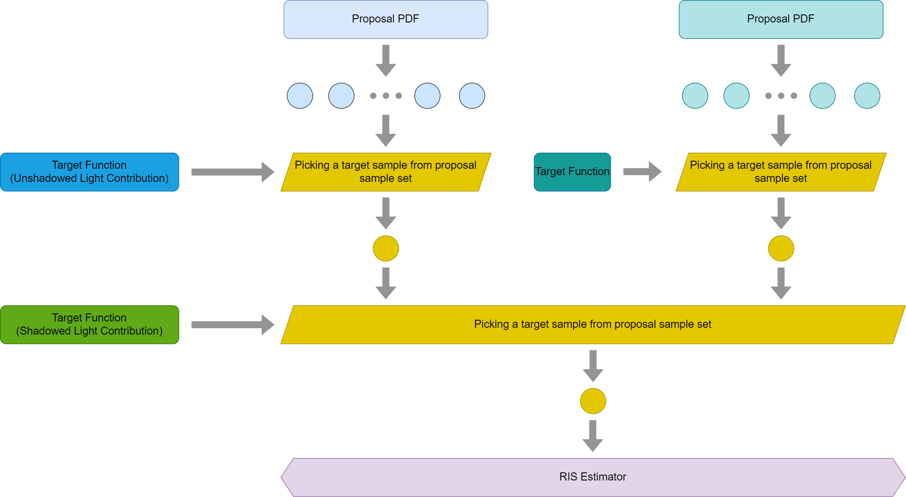



图片与部分证明来自[Understanding The Math Behind ReSTIR DI](https://agraphicsguynotes.com/posts/understanding_the_math_behind_restir_di/)

## 重采样重要性抽样

令\\(x\\)的目标概率分布为\\(\hat{p}(x)\\), 它可能难以被重要性抽样. 我们为每个样本选择一个容易抽样的提议分布\\(p_i(X)\\), 选出\\(M\\)个样本组成序列\\(\bold{x}\\), 然后将每个样本的权重设置为\\(w_i(x_i)=\frac{\hat{p}(x_i)}{p_i(x_i)}\\), 随机选择其中一个样本\\(x_z\\), 此时概率如下.

$$
\begin{equation}
\begin{aligned}
p(z|\bold{x})
&=\frac{w_z(x_z)}{\sum_{i=1}^M w_i(x_i)}
\end{aligned}
\end{equation}
$$

证明采用RIS进行Monte Carlo最终可以收敛的过程如下, 其中\\(y\\)为每次RIS所选择到的样本, \\(p'\\)为RIS后被选中的概率. 可以看出\\(\sum\_{k=1,p_k(x) \neq 0}^Mm(x)=1\\)即可无偏. 由于目标概率分布被抵消, 不要求为积分为\\(1\\), 渲染任务可选择Kajiya积分项为\\(\hat{p}(x)\\).

$$
\begin{equation}
\begin{aligned}
E(\frac{1}{N}\sum_{i=1}^N\frac{f(y_i)}{\hat{p}(y_i)}m(y_i)\sum_{j=1}^Mw_j(x_{ij}))
&=\frac{1}{N}\sum_{i=1}^NE(\frac{f(y)}{\hat{p}(y)}m(y)\sum_{j=1}^Mw_j(x_j))\\\\
&=E(\frac{f(y)}{\hat{p}(y)}m(y)w_{\text{sum}})\\\\
&=\sum_{k=1,p_k(x_k) \neq 0}^M\int\cdots\int\frac{f(x_k)}{\hat{p}(x_k)}m(x_k)w_{\text{sum}}p'(x_k)dx_1 \cdots dx_M\\\\
&=\sum_{k=1,p_k(x_k) \neq 0}^M\int\cdots\int\frac{f(x_k)}{\hat{p}(x_k)}m(x_k)w_{\text{sum}}\frac{w_k(x_k)}{w_{\text{sum}}}\prod_{i=1}^Mp_i(x_i)dx_1 \cdots dx_M\\\\
&=\sum_{k=1,p_k(x_k) \neq 0}^M\int\cdots\int f(x_k)m(x_k)\prod_{i=1,i \neq k}^Mp_i(x_i)dx_1 \cdots dx_M\\\\
&=\sum_{k=1,p_k(x_k) \neq 0}^M\int f(x_k)m(x_k)dx_k\int\cdots\int\underbrace{\prod_{i=1,i \neq k}^Mp_i(x_i)\underbrace{dx_1 \cdots dx_M}_{\text{M - 1, except k}}}\_{1}\\\\
&=\int \sum\_{k=1,p_k(x) \neq 0}^Mm(x)f(x)dx\\\\
\end{aligned}
\end{equation}
$$

## 蓄水池抽样

蓄水池抽样只保留一个样本, 样本保留的概率是当前样本的权重与所有已知样本权重和的比值. 蓄水池抽样更新过程如下. 保留新样本, 概率值为\\(\frac{w_i}{W}\\); 保留旧样本, 概率值为\\(\frac{w_j}{W'}\frac{W - w_i}{W}=\frac{w_j}{W'}\frac{W'}{W}=\frac{w_j}{W}\\). 可见概率值一定会更新为权重与已知权重和的比值.

```
Reservoir s, Sample sp, Weight w
s.W += w;
if u < w / s.W then
    s.y = sp;
```

若要合并多个蓄水池, 将每个蓄水池的权重和作为合并权重, 将蓄水池本身作为样本, 对多个蓄水池执行蓄水池抽样过程即可, 此时被选中的蓄水池中的样本的概率更新为\\(\frac{w_i}{W_j}\frac{W_j}{\sum_{k=1}^n W_k}=\frac{w_i}{\sum_{k=1}^n W_k}\\), 仍然满足要求.

## 时空复用

假设所有样本提议分布相同, 则\\(m(y)=\frac{1}{M}\\), 使得\\(w_{\text{sum}}=\hat{p}(y)WM\\), 得到有偏结果.

```
Reservoir s
for r in {r1, ..., rk} do
    s.update(r.y, p_hat(r.y) * r.W * r.M)
s.M = s1.M + s2.M + ... + sk.M
```

为实现无偏需保证\\(p_k(y) > 0\\), 由于相邻像素来自于重采样, \\(p_k(y)\\)是未知的, 但由重采样过程可知, \\(\hat{p}(y)=0\\)时样本选中概率为0, 可用相邻像素的目标分布来测试\\(p_k(y) > 0\\), 即执行阴影测试.

```
for qi in {q1, ..., qk} do
    if p_hat_qi(s.y) > 0 then
        Z += ri.M
m = 1 / Z
```


