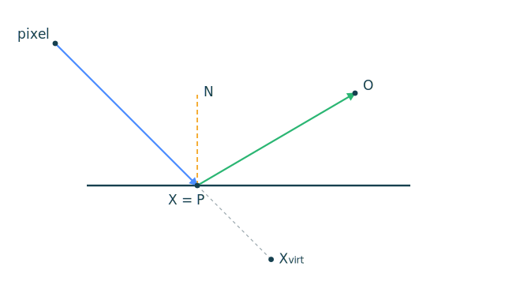
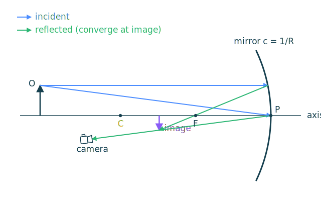
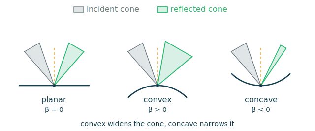
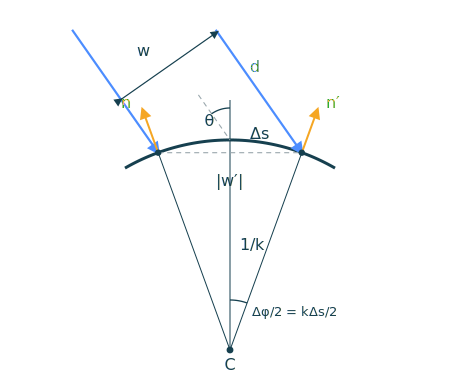
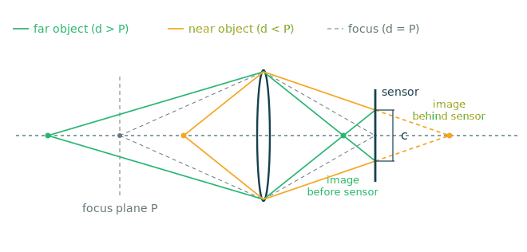
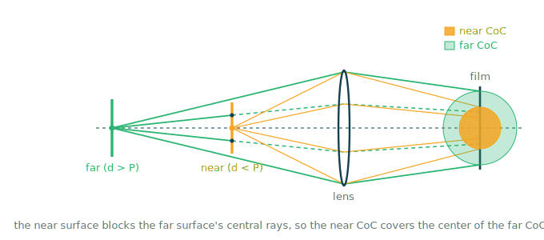

## Virtual Position

ReBLUR计算镜面反射虚拟位置使用高斯球面镜成像公式解出像距/物距.

$$
\begin{equation}
\mathrm{mag} = \frac{1}{2 \cdot c \cdot O_z - 1}
\end{equation}
$$

整体光路如下: 主光线从像素打到着色点$X=P$, 再沿反射方向走$\mathrm{hitDist}$命中物点$O$; 把表面当作曲面镜, 用$\mathrm{mag}$算出虚像$X_{virt}$, 沿视线方向摆放, 供时间重投影使用.

下面把表面局部视为曲率为$c$的球面镜, 推导$\mathrm{mag}$.

设球面镜:

- 半径$R$, 曲率中心$C$, 顶点$P$, 焦点$F$($\overline{PF}=R/2$)
- 光轴为直线$CP$
- 轴外物点$O$, 物距$d_o = \overline{OP}$(沿轴), 物高$h_o$
- 像点$I$, 像距$d_i = \overline{IP}$, 像高$h_i$

从物点顶端发出两条特殊光线, 汇聚到像点$I$.

- 平行光线: 平行于光轴入射, 反射后过焦点$F$
- 主光线: 射向顶点$P$, $P$处法线即光轴

由相似三角形可得:

$$
\begin{equation}
\frac{|h_i|}{h_o} = \frac{d_i}{d_o}.
\end{equation}
$$

凹面镜像在负轴, 故倒立, 横向放大率为:

$$
\begin{equation}
m = \frac{h_i}{h_o} = -\frac{d_i}{d_o},
\end{equation}
$$

傍轴近似认为镜面在位置上为平面, 以$F$为公共顶点的两个相似三角形给出

$$
\begin{equation}
\frac{h_o}{f} = \frac{|h_i|}{d_i - f}, \qquad f = \frac{R}{2},
\end{equation}
$$

两式联立消去$|h_i|/h_o$:

$$
\begin{equation}
\frac{d_i}{d_o} = \frac{d_i - f}{f} = \frac{d_i}{f} - 1.
\end{equation}
$$

两边同除$d_i$并整理, 得Gaussian镜面方程.

$$
\begin{equation}
\frac{1}{d_o} + \frac{1}{d_i} = \frac{1}{f} = \frac{2}{R}.
\end{equation}
$$

记曲率$c = \dfrac{1}{R}$, 物距$d_o = O_z$, 解像距:

$$
\begin{equation}
\frac{1}{d_i}
= 2c - \frac{1}{d_o}
= \frac{2c\,d_o - 1}{d_o},
\qquad
d_i = \frac{d_o}{2c\,d_o - 1}.
\end{equation}
$$

ReBLUR需要的是沿视线的像距与物距之比:

$$
\begin{equation}
\mathrm{mag}
= \frac{d_i}{d_o}
= \frac{1}{2 \cdot c \cdot O_z - 1},
\end{equation}
$$

平面镜即$R \to \infty$, 亦即$c = 0$, 此时$d_i = -d_o$, 虚像在镜后.

$$
\begin{equation}
\mathrm{mag} = \frac{1}{0 - 1} = -1,
\end{equation}
$$

## Ray Cone

光锥从像素以张角$\alpha$射出, 命中点距相机$t$时, cone在该点的宽度为:

$$
\begin{equation}
w_0 = 2t\tan\frac{\alpha}{2} \approx \alpha t.
\end{equation}
$$

在曲面上反射时, 曲率会改变cone的张角. RT Gems用标量$\beta$建模: 平面 $\beta=0$ 张角不变, 凸面张角增大, 凹面 张角减小, 曲率较大的凹面导致张角为负, 在镜面上方汇聚.

反射算子$R(\mathbf{n})=I-2\mathbf{n}\mathbf{n}^\top$给出$\mathbf{d}_r=\mathbf{d}-2(\mathbf{d}\cdot\mathbf{n})\mathbf{n}$, 每条光线的天顶角关系为:

$$
\begin{equation}
\theta_r = 2\theta_n - \theta_d,
\end{equation}
$$

求相邻光线微分, $\mathrm{d}\theta_d$为入射锥张角, $\mathrm{d}\theta_r$为出射锥体张角, $2\mathrm{d}\theta_n$为曲率贡献. 例如平面镜$\mathrm{d}\theta_n=0$, $\mathrm{d}\theta_r=-\mathrm{d}\theta_d$

$$
\begin{equation}
\mathrm{d}\theta_r = 2\,\mathrm{d}\theta_n - \mathrm{d}\theta_d.
\end{equation}
$$

记法线变化角$\phi=\mathrm{d}\theta_n$:

$$
\begin{equation}
\beta = 2\,\mathrm{d}\theta_n = 2\phi.
\end{equation}
$$

单位法线满足$\mathbf{n}\cdot\mathbf{n}=1$, 像素坐标微分为$\mathbf{n}\cdot\frac{\partial\mathbf{n}}{\partial x}=0$, 即$\frac{\partial\mathbf{n}}{\partial x}\perp\mathbf{n}$. 移动一个像素得一阶近似新法线$\mathbf{n}+\frac{\partial\mathbf{n}}{\partial x}$, 可基于二者形成的直角三角形计算曲率贡献.

$$
\begin{equation}
\phi_x=\arctan\left\|\frac{\partial \mathbf{n}}{\partial x}\right\|,\qquad
\phi_y=\arctan\left\|\frac{\partial \mathbf{n}}{\partial y}\right\|.
\end{equation}
$$

凸面上位置与法线沿同向变化, 反之为凹面, 可基于符号区分.

$$
\begin{equation}
s=\mathrm{sign}\left(\frac{\partial P}{\partial x}\cdot\frac{\partial \mathbf{n}}{\partial x}+\frac{\partial P}{\partial y}\cdot\frac{\partial \mathbf{n}}{\partial y}\right)
\end{equation}
$$

代入$\beta=2\phi$得:

$$
\begin{equation}
\begin{aligned}
\beta
&= 2s\phi = 2s\sqrt{\phi_x^2+\phi_y^2}\\
&= 2s\sqrt{\arctan^2\left\|\frac{\partial \mathbf{n}}{\partial x}\right\|+\arctan^2\left\|\frac{\partial \mathbf{n}}{\partial y}\right\|}\\
&\approx 2s\sqrt{\left\|\frac{\partial \mathbf{n}}{\partial x}\right\|^2+\left\|\frac{\partial \mathbf{n}}{\partial y}\right\|^2}.
\end{aligned}
\end{equation}
$$

$\frac{\partial\mathbf{n}}{\partial x}$不依赖G-Buffer, 可用光线微分计算. 相机单位基为$\mathbf{x}$(右)、$\mathbf{y}$(上)、$\mathbf{z}$(前), 令$a$为宽高比, $f = \tan\frac{\mathrm{fov}}{2}$, $c_{x,y}$为NDC坐标, 非归一化方向$\mathbf{D}=c_x\,af\,\mathbf{x}+c_y\,f\,\mathbf{y}+\mathbf{z}$. 令分辨率为$w \times h$, 对像素坐标求微分:

$$
\begin{equation}
\bar{\mathbf{x}}=\frac{\partial\mathbf{D}}{\partial x}=\frac{2af}{w}\mathbf{x},\qquad
\bar{\mathbf{y}}=\frac{\partial\mathbf{D}}{\partial y}=\frac{2f}{h}\mathbf{y}.
\end{equation}
$$

单位方向$\mathbf{d}=\frac{\mathbf{D}}{\lVert\mathbf{D}\rVert}$的微分使用归一化雅可比:

$$
\begin{equation}
\frac{\partial\mathbf{d}}{\partial x}=\frac{(\mathbf{D}\cdot\mathbf{D})\,\bar{\mathbf{x}}-(\mathbf{D}\cdot\bar{\mathbf{x}})\,\mathbf{D}}{(\mathbf{D}\cdot\mathbf{D})^{3/2}},
\end{equation}
$$

命中点$P=O+t\,\mathbf{d}$, 针孔相机光线共原点, 因此$\frac{\partial O}{\partial x}=0$, 令$\mathbf{q}_x=t\frac{\partial\mathbf{d}}{\partial x}$. 令三角形边为$\mathbf{e}_1=P_1-P_0$, $\mathbf{e}_2=P_2-P_0$, 记

$$
\begin{equation}
\mathbf{c}_0=\mathbf{e}_2\times\mathbf{d},\quad
\mathbf{c}_1=\mathbf{d}\times\mathbf{e}_1,\quad
k=(\mathbf{e}_1\times\mathbf{e}_2)\cdot\mathbf{d},
\end{equation}
$$

重心参数化得$P=P_0+b_0\mathbf{e}_1+b_1\mathbf{e}_2$, 它又等于光线式 $P=O+t\mathbf{d}$, 等式求微分:

$$
\begin{equation}
\frac{\partial b_0}{\partial x}\mathbf{e}_1+\frac{\partial b_1}{\partial x}\mathbf{e}_2=\mathbf{q}_x+\frac{\partial t}{\partial x}\mathbf{d}.
\end{equation}
$$

两边点乘$\mathbf{c}_0$可用正交性消去$\frac{\partial b_1}{\partial x}$与$\frac{\partial t}{\partial x}$项, 点乘 $\mathbf{c}_1$ 同理, 再除以 $k$:

$$
\begin{equation}
\frac{\partial b_0}{\partial x}=\frac{\mathbf{c}_0\cdot\mathbf{q}_x}{k},\qquad
\frac{\partial b_1}{\partial x}=\frac{\mathbf{c}_1\cdot\mathbf{q}_x}{k}.
\end{equation}
$$

对法线重心重新插值求微分:

$$
\begin{equation}
\frac{\partial\mathbf{n}}{\partial x}=\frac{\partial b_0}{\partial x}(\mathbf{n}_1-\mathbf{n}_0)+\frac{\partial b_1}{\partial x}(\mathbf{n}_2-\mathbf{n}_0),
\end{equation}
$$

多次弹射缺少屏幕空间法线微分, 近似图元为圆, 使用边曲率定义$k = \frac{\Delta\phi}{\Delta s} = \frac{1}{r}$估计$\Delta \phi$.

$$
\begin{equation}
\Delta \phi = r\Delta s = 2r\arcsin\frac{|w'|}{2r} = \frac{2}{k}\arcsin\frac{k|w|}{-2\mathbf{n}\cdot\mathbf{d}}
\end{equation}
$$

小张角下$\arcsin x \approx x$, $\Delta s \approx |w'|$, 张角变化简化为:

$$
\begin{equation}
\beta_c = -2k\frac{|w|}{\mathbf{n}\cdot\mathbf{d}}.
\end{equation}
$$

三角形曲率不易精确求得, 退而用逐边近似. 边$P_0P_1$的曲率(Reed)为

$$
\begin{equation}
k_{01} = \frac{1}{r} = \frac{(\mathbf{n}_1-\mathbf{n}_0)\cdot(P_1-P_0)}{(P_1-P_0)\cdot(P_1-P_0)},
\end{equation}
$$

多次弹射对精度要求低, 取三边平均即可:

$$
\begin{equation}
k = \frac{k_{01}+k_{12}+k_{20}}{3}.
\end{equation}
$$

除几何曲率外, 材质粗糙度$\alpha$也会展宽cone. 实践中主光线$\beta = \frac{\sigma}{4}$, 次级光线$\beta = \sigma$.

$$
\begin{equation}
\sigma^2 = \frac{1}{2}\frac{\alpha^2}{1-\alpha^2},
\end{equation}
$$

光锥近似成沿$\mathbf{d}$, 半径$\frac{w_i}{2}$的圆柱, 与法线为$\mathbf{n}$的三角形相交, 施密特正交化得椭圆轴$\mathbf{h}_1$, $\mathbf{h}_2$. 相似三角形把轴伸到圆柱面($k=1,2$), 在命中点$P$沿轴取$P+\mathbf{a}_1$、$P+\mathbf{a}_2$, 用重心坐标插值纹理坐标, 减去中心纹理坐标得梯度.

$$
\begin{equation}
\mathbf{a}_k = \frac{w_i/2}{\lVert \mathbf{h}_k-(\mathbf{d}\cdot\mathbf{h}_k)\mathbf{d}\rVert}\,\mathbf{h}_k.
\end{equation}
$$
## Ambient Occlusion

屏幕空间像素共线则代表对应的光线共面, 因此可求基于中心像素光线的半球切面积分. 环境光遮蔽是基于法线的, 转为基于视线. 法线拆分为投影到/垂直于切面的分量, 切面上立体角和法线点积相当于只点积投影分量, 因此$\gamma=\mathbf{v}\cdot\mathbf{n}_p$.

在屏幕空间沿$\phi$对应的切面向两侧搜索, 评估深度得到的最大视线夹角为$\theta_0(\phi)$和$\theta_1(\phi)$, 令$h_0=\max(-\theta_0(\phi), \gamma - \frac{pi}{2})$, $h_1=\min(\theta_1(\phi), \gamma + \frac{pi}{2})$, 可得:

$$
\begin{equation}
A(p)=\frac{1}{\pi}\int_0^\pi\int_{h_0}^{h_1}\cos(\theta-\gamma)|\sin\theta|\mathrm{d}\theta\mathrm{d}\phi
\end{equation}
$$

 $h_{0,1}$已知时可得解析解, 被积函数积化和差展开:

$$
\begin{equation}
\begin{aligned}
\cos(\theta-\gamma)\sin\theta&=\tfrac{1}{2}\cos\gamma\sin2\theta+\tfrac{1}{2}\sin\gamma-\tfrac{1}{2}\sin\gamma\cos2\theta\\
\int\cos(\theta-\gamma)\sin\theta\,\mathrm{d}\theta&=\tfrac{1}{2}\theta\sin\gamma-\tfrac{1}{4}\cos(2\theta-\gamma)\\
A(p)_\phi&=\frac{1}{4}\sum_{i\in\{1,2\}}\Big(\cos\gamma+2h_i\sin\gamma-\cos(2h_i-\gamma)\Big).
\end{aligned}
\end{equation}
$$

## Depth Of Field

薄透镜成像公式给出物距$d_o$与像距$d_i$的关系:

$$
\begin{equation}
\frac{1}{d_o} + \frac{1}{d_i} = \frac{1}{F}.
\end{equation}
$$

令对焦平面为$P$, 像距为$v = \dfrac{FP}{P-F}$. 物点偏离对焦面时像点不聚焦于传感器, 光圈形成锥体在传感器上截出弥散圆. 令光圈直径$A = F/N$, 物距$d$处像距$v_d = \dfrac{Fd}{d-F}$, 由相似三角形, 传感器上弥散圆直径为$c = A\dfrac{v_d - v}{v_d}$. 代入化简:

$$
\begin{equation}
c = \frac{A F}{P - F}(1 - \frac{P}{d}).
\end{equation}
$$

近景与远景物体分别成像于传感器之后与之前并形成弥散圆, 落在对焦面上的物点才汇聚.

$d \to \infty$时$1 - P/d \to 1$, 得到最大远景弥散圆.

$$
\begin{equation}
c_\infty = \frac{A F}{P - F}
\end{equation}
$$

由于光路传播过程的遮挡, 弥散圆存在深度遮蔽; 同样的, 即使针孔相机中被遮挡的物体, 也有部分弥散圆到达成像平面.

较大的远景弥散圆对应较远的深度, 实时景深可以由远到近的采样来估计遮蔽以平滑远近交界处的景深, 同时近景像素使用相邻像素补充被遮蔽的远景产生的弥散圆.

## Auto Exposure

$N=$ f-stop, $t=$ 快门时间, $S=$ 感光度, $L=$ 场景亮度, $K=$ 校准常数. ISO 2720测光方程如下, 相机自动曝光获取$L$后调整$N$, $S$, $t$来满足测光方程.

$$
\begin{equation}
\frac{N^2}{t} = \frac{L \cdot S}{K}.
\end{equation}
$$

根据相机设置得到曝光值$EV$, $EV$每$+1$进光量减半.

$$
\begin{equation}
EV = \log_2\frac{N^2}{t},
\end{equation}
$$

$EV$未锁定感光度, 归一到ISO 100得$EV_{100}$, 成为只描述场景亮度的绝对量.

$$
\begin{equation}
EV_{100} = \log_2\frac{N^2}{t}\frac{100}{S} = \log_2\frac{L \cdot 100}{K}.
\end{equation}
$$

由ISO 2720饱和度公式求$EV_{100}$某个值下传感器可容纳的最大亮度$L_{max}$.

$$
\begin{equation}
L_{max} = \frac{78}{S \cdot q} \cdot 2^{EV_{100}} = \frac{78}{100 \cdot 0.65} \cdot 2^{EV_{100}} = 1.2 \cdot 2^{EV_{100}}.
\end{equation}
$$

取倒数归一化场景亮度, 得到自动曝光结果.

$$
\begin{equation}
exposure = \frac{1}{L_{max}} = \frac{1}{1.2 \cdot 2^{EV_{100}}}.
\end{equation}
$$

实时自动曝光可以将亮度分桶以裁掉极端值. 局部曝光通过读取亮度下采样Mipmap实现, 每个等级的像素只统计局部亮度, 等级越高统计范围越大.

## PRTGI

以立方体为单元生成探针, 探针摆放在8个顶点. 可设置烘焙LOD, LOD+1则边长翻倍. 根据最粗LOD的立方体划分场景区块.

每个区块执行X/Y/Z三轴投影保守光栅化, 若只做单轴投影, 与投影方向近乎平行的三角形投影面积趋近零,光栅化片元无法覆盖穿过的所有体素.

完成光栅化后基于Jump Flooding生成距离场并摆放探针, 同时使用物理系统光线进行阴影测试, 获取探针的虚拟偏移.

探针将场景光栅化到立方图G-Buffer(基础色, 法线, 世界位置), 用于后续采样面素. 烘焙时将探针分批, 同一批次绘制到一张图集上, 使得多个探针的绘制共享顶点着色器结果.

面素采样时在工作组内求解天空可见性球谐系数, 使用整数位置, 法线主方向和采样光线是否命中得到64位Morton码, 相同时执行面素去重, 高位相同则合并为砖块. 砖块计算平均位置和法线, 用于计算探针使用砖块时的权重.

运行时使用环形寻址流式加载探针, 根据各类优先级策略选择当前帧更新的探针. 为避免砖块由于相机运动被频繁的换入换出, 砖块记录引用计数, 归0后记录LRU, 多次流式加载后仍然未被使用再执行释放.

## ReSTIR GI

半分辨率执行漫反射的追踪与时空复用, 追踪时以图块为单位执行俄罗斯轮盘, 测试失败后拒绝发射光线, 复用历史帧蓄水池.

空间复用时采样噪声以随机化采样半径与旋转方向, 造成缓存未命中, 通过让同一图块共享随机数提高缓存局部性, 提升五倍性能.

上采样时采样最近的4个蓄水池, 基于蓄水池与切面的距离添加权重, 由于漫反射方向无关, 可以添加余弦项后统计辐照度.

时域降噪时对样本执行色调映射, 且不执行邻域钳制, 避免样本方差导致的不稳定, 同时针对时域累积率较低的像素执行空间降噪.

## SSSR

UE分离求和方法将镜面反射Monte-Carlo拆成两项, SSSR只统计辐照度积分, PDF不纳入统计, 这使得生成的样本不会超过场景颜色范围, 避免尖峰化的波瓣执行重要性抽样生成的样本方差过大. 同时也会将材质与光照分离, 抑制降噪产生的模糊.

$$
\begin{equation}
\frac{1}{N}\sum_{k=1}^N\frac{L_i(\omega_i)f(p, \omega_i, \omega_o)\cos\theta_i}{p(\omega_i, \omega_o)}
\approx
\frac{1}{N}\sum_{k=1}^N L_i(\omega_i)\frac{1}{N}\sum_{k=1}^N\frac{f(p, \omega_i, \omega_o)\cos\theta_i}{p(\omega_i, \omega_o)}
\end{equation}
$$
