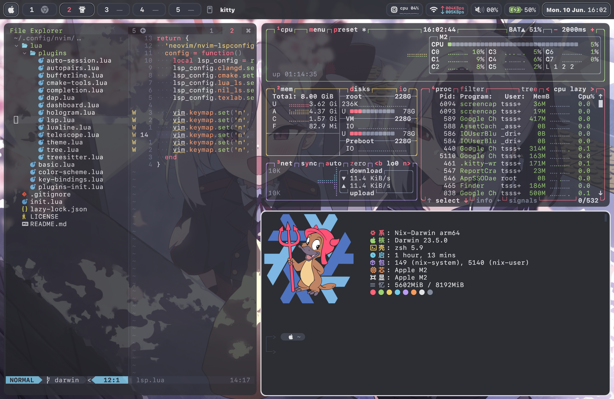
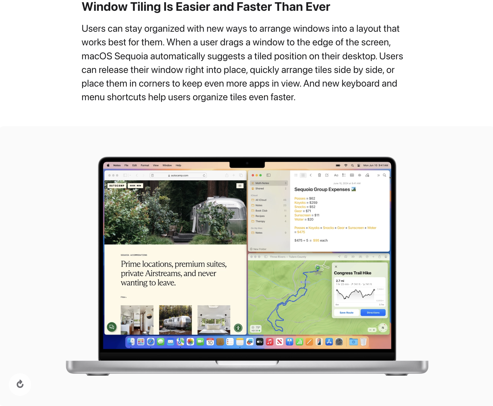
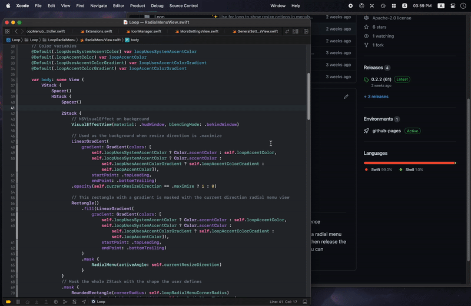

配置仓库见[nix-config](https://github.com/tsssni/nix-config/tree/nix-darwin),
fork自[SketchyBar作者的配置](https://github.com/FelixKratz/dotfiles),
由home-manager管理, 当前效果如下.




Rice一词来自于Race Inspired Cosmetic Enhancements, 即通过改装提高廉价赛车的性能(我看到的说法是日本赛车为主),
在程序员这里Rice被引申为对系统外观的美化, 以Unix系系统为主,
很多人会将自己的Rice分享到Reddit上的[unixporn](https://www.reddit.com/r/unixporn/)社区.

原本计划端午节学习Yabai与SketchyBar的配置文件并将整体配色由Sonokai修改为我的
[NixOS配置](https://github.com/tsssni/nix-config/tree/nixos)中的自定义配色方案,
然而不论是使用体验还是视觉观感这三个月来当前的桌面配置对我而言都是一个完美的状态,
所以今天只记录一下配置方式以及Nix配置中踩过的坑.
当然, 记录和感想为主, 并不是教程与技术分析.

## Yabai


毕竟不是Linux, [Yabai](https://github.com/koekeishiya/yabai)的功能依赖于MacOS使用的Aqua WM,
在闭源代码上做一层套娃效果自然是无法与Linux上的Hyprland、Sway等开源WM相比的,
而Apple对兼容性的忽视也是名声在外, 每次系统更新Yabai都会伴随着部分功能的失效.

也正是如此我对Yabai的作者[koekeishiya](https://github.com/koekeishiya)是很钦佩的,
根据github的数据可以说他是以一己之力推进着Yabai的维护.
在写这篇文章时我一直都在为假期的流逝而焦虑, 来自峡湾之国的他会不会为此烦恼呢? 

晚上熬大夜看完了WWDC 2024, 大部分时间都在Apple Intelligence,
不过MacOS Sequoia部分提到了自动Window Tiling和快捷键,
对于第三方WM是利是弊还有待观察, 期待未来的MacOS实现原生的Yabai体验.



写到这里才发现自己对MacOS上的WM知之甚少, 不妨在这里多探讨一些.
[这个链接](https://docs.google.com/spreadsheets/d/1JqyglRJXzxaj8OcQw9jHabxFUdsv9iWJXMPXcL7On0M/edit?pli=1#gid=456166567)基本囊括了MacOS上的所有WM了,
[这个reddit贴子](https://www.reddit.com/r/macapps/comments/1arq5a6/whats_the_best_window_manager/)里还提到了
[Lasso](https://thelasso.app/)和[Raycast Window Management Extension](https://www.raycast.com/extensions/window-management).
最让我新奇的是里付费闭源WM占据了MacOS的半壁江山,
在我的印象(刻板印象?)里WM都是Geeker们折腾的开源玩具.
其实还挺想体验一下的, 可惜没钱, 估计我8+256的丐版Air也经不起这折腾.

最终找到的比较流行的开源WM比我想象中要多不少, MacOS的开源生态实际上还是不错的.
有哪个程序员会不喜欢Unix呢, 在我买Mac时这是除了续航之外最重要的原因了.
简单浏览了一下各个项目的README和Wiki, 我这里大致梳理一下各自的特色.

[Amethyst](https://github.com/ianyh/Amethyst)是遵循[xmonad](https://xmonad.org/)标准的WM,
距今已经11年了. Amethyst是紫水晶, 而MacOS的图形层Quartz是水晶, 很有意思的名字.
Yabai只支持BSP、Float与Stack布局, 而Amethyst Wiki中一共介绍了14种布局,
大部分都是固定一个主要窗口, 其余窗口按需排列与切换.
Amethyst的布局使用js配置, 就在去年Amethyst支持了[自定义布局](https://github.com/ianyh/Amethyst/blob/v0.21.0/docs/custom-layouts.md),
可以用户自定义窗口状态变化以及扩展现有布局.
Amethyst的所有功能都不需要关闭[SIP](https://developer.apple.com/documentation/security/disabling_and_enabling_system_integrity_protection),
但也因此功能上没有Yabai丰富, 例如透明度、移动工作区等功能都是缺失的.

Yabai是2019年的项目, 但是和Amethyst都是用Objective-C写出来的老东西,
与Yabai同时代的[Rectangle](https://github.com/rxhanson/Rectangle)已经用上Swift了.
Rectangle基于已经archvie的[Spectacle](https://github.com/eczarny/spectacle),
集成[MAShortcut](https://github.com/cocoabits/MASShortcut)作为快捷键系统, 支持图形化快捷键配置.
Rectangle只支持修改窗口的位置与大小, 并不会管理布局, 可以通过鼠标拖拽自动执行Window Tiling,
例如左右拖动让窗口占据半个屏幕, 朝上拖动让窗口最大化.
显然这没有Sequoia引入的Window Tiling智能, 后续可能会跟进官方的新API.

Rectang是自由软件, 但是Rectangle Pro是收费的, 支持管理布局、更丰富的快捷键、云端配置存储等功能.
私以为管理布局是WM最核心的功能, 这么定义的话Rectangle这个残血版可能都不能称之为WM了.


[Loop](https://github.com/mrkai77/loop)是2023年的新项目,
着重强调风格化的window resize, 从下面的官方示例中可以看出来对鼠标的支持非常丝滑.
Loop仍然处于beta测试阶段, 只支持Ventura以上的版本.
随着使用时间增加Loop的图标会发生变化, 很酷炫的功能.



[AeroSpace](https://github.com/nikitabobko/AeroSpace)同样诞生于2023,
但是要更传统一些, 主要目标是为用户带来类似于i3的窗口管理体验.
AeroSpace不需要关闭SIP, 拥有自定义的虚拟工作区, 不依赖于Auqa的工作区系统.
但是从[官方Demo](https://www.youtube.com/watch?v=UOl7ErqWbrk)来看动画支持是几乎没有的,
配置文件是我很不喜欢的toml格式(说起来Hugo也是toml为主, 但是也支持json, json赛高!),
没有给我什么眼前一亮的感觉.

说回正题, 粗略浏览了Yabai的源代码, Yabai主要通过C/S结构的进程间通信实现WM配置,
即server进程监听socket, client向socket中写入message.
因此Yabai可以通过shell实现动态配置, Yabai的默认配置文件也只是shell script,
窗口外观配置以及移动窗口、创建工作区等操作都可以通过message来实现. Yabai message格式写在下面.
[Yabai Wiki](https://github.com/koekeishiya/yabai/wiki/Configuration)中只介绍了一小部分配置,
需要阅读man page才能一览全貌, 我这里不会介绍具体配置选项, man page中有很详细的说明.

```sh
yabai -m <message> <settings> 
```

与其他WM不同, Yabai本身不包括快捷键系统.
Yabai作者的另一个项目[skhd](https://github.com/koekeishiya/skhd)提供了快捷键配置,
其他第三方软件也是可行的, 支持通过快捷键执行shell script即可.
在我的Hyprland配置中WM的快捷键以super作为基础键,
但MacOS中的大量快捷键已经占据了super(command),
而control和option被我的[neovim配置](https://github.com/tsssni/nvim-config)占用,
无奈之下只好通过control + command / option + command来实现, 单手操作会很扭曲.
skhd示例如下, 实现了切换工作区的功能:
```sh
# Space Navigation
lalt + lcmd - 1 : SPACES=($(yabai -m query --displays --display | jq '.spaces[]')) && [[ -n $SPACES[1] ]] && yabai -m space --focus $SPACES[1]
lalt + lcmd - 2 : SPACES=($(yabai -m query --displays --display | jq '.spaces[]')) && [[ -n $SPACES[2] ]] && yabai -m space --focus $SPACES[2]
lalt + lcmd - 3 : SPACES=($(yabai -m query --displays --display | jq '.spaces[]')) && [[ -n $SPACES[3] ]] && yabai -m space --focus $SPACES[3]
lalt + lcmd - 4 : SPACES=($(yabai -m query --displays --display | jq '.spaces[]')) && [[ -n $SPACES[4] ]] && yabai -m space --focus $SPACES[4]
lalt + lcmd - 5 : SPACES=($(yabai -m query --displays --display | jq '.spaces[]')) && [[ -n $SPACES[5] ]] && yabai -m space --focus $SPACES[5]
```

Linux WM中常见的border在Yabai中也是缺失的,
我使用的是[JankyBorders](https://github.com/FelixKratz/JankyBorders),
只提供了颜色、宽度、边缘形状、黑白名单等最基础的功能, 比微信要小而美就是了. 我的配置放在下面.
```sh
#!/bin/bash

options=(
	style=round
	width=6.0
	hidpi=off
	active_color=0xc0e2e2e3
	inactive_color=0xc02c2e34
	background_color=0x302c2e34
)

borders "${options[@]}"
```

## SketchyBar


接触Unix Rice时往往最先考虑使用哪一个WM, MacOS上还好,
Linux上没有WM的话可就得对着Terminal敲代码了,
当然如果会VIM、Emacs这类Editor的话体验也还可以.
但WM管理的仅仅只是窗口而已, 重点在快捷方便而不是美观,
私以为每时每刻都能见到的Status Bar才是Rice的核心部分.
各类开源Status Bar往往具有极高的可定制性,
不像chrome这类商业应用只提供有限的外观选项.
选好WM与壁纸, 写好Status Bar, 配置好terminal,
这就是一次完整的Rice.

[SketchyBar](https://github.com/FelixKratz/SketchyBar) fork自[spacebar](https://github.com/cmacrae/spacebar),
启发自Yabai已经移除的内置Status Bar. 也正因如此SketchyBar的配置方式与Yabai是一脉相承的, 与Yabai配合的很好.
SketchyBar官网上列出了很多示例Status Bar, 可以看出定制能力是非常强悍的.
MacOS Ricer们真的很喜欢在Status Bar上放一个Apple Logo.


当然SketchyBar仍然只提供Status Bar相关的功能,
和Linux上的[EWW](https://github.com/elkowar/eww)以及[AGS](https://github.com/Aylur/ags)等自定义Widget相比定制化能力还是差了一截的.
阅读Yabai文档时我才了解到MacOS上也有个叫[Übersicht](https://github.com/felixhageloh/uebersicht)的自定义Widget,
支持使用CoffeeScript或JavaScript来编写配置, 底层是React.
挺后悔刚接触Rice时学的是EWW, EWW的配置语言是一门叫yuck的lisp方言, 不是很适合编写Widget.
但如果我是作者, 拥有一门自己的语言真的很酷, 还是一门函数式语言, 更酷了.

[SketchyBar官方文档](https://felixkratz.github.io/SketchyBar/)比Yabai的要好很多, 各类配置都可以查到.
SketchyBar将Status Bar分为Bar与Item两个部分, Bar是轮船, Item是集装箱, 各个Item具有独立的功能与样式(就像Docker的logo一样).
或者可以这样理解, Bar是一个特殊的Item, 可以自定义样式但是不能自定义功能, 只负责为其他Item提供绘制区域. 

SketchyBar通过注册事件与用户提供的shell script实现Item属性的自动化修改, 支持用户自定义事件.
SketchyBar有内置的动画系统, 支持通过动画曲线修改任意通过颜色与整数定义的属性, 十分甚至九分的灵活.

此外SketchyBar支持数据图、滑条等特殊组件, 支持额外的弹出菜单,
甚至支持将MacOS中各个应用的Menu Bar直接映射到SketchyBar上,
这是最令我印象深刻的功能, 让SketchyBar可以真正的融入到日常工作流中.
但是通过点击触发系统自带的弹出菜单的功能仍在开发中,
在作者自己的配置里通过一个[小程序](https://github.com/FelixKratz/dotfiles/tree/master/.config/sketchybar/helpers/menus)实现了这个功能.


SketchyBar作者最近有个新项目叫[SbarLua](https://github.com/FelixKratz/SbarLua), 是SketchyBar的一个插件, 支持用Lua写配置.
这算是我与SketchyBar深入交流的一次契机, 给SbarLua打Nix包让我第一次从源码层面去了解一个开源项目并解决冲突.

首先聊一下打包过程, 打包代码放在下面. 参数里有Lua包,
但是Nix似乎并不支持将手动指定的依赖暴露在$PATH中,
Nix的依赖系统只是会自动修改动态库的路径.
这导致无法直接执行Lua命令, 我目前没有找到解决办法, 需要用户自己在Nix配置中手动安装Lua.
我这里指定的编译器是gcc而不是clang, 因为SbarLua编译过程中需要使用gcc指令.
在MacOS上gcc是被alias到clang的, 但是Nix的编译环境是与系统无关的,
不包含任何预设的环境变量的, 指定clang作为编译器会导致编译过程中找不到gcc.
当然, 就算我指定使用clang, Nix使用的也是nixpkgs中的clang而非系统中的clang,
通常来说版本会新很多.

```Nix
{
  lib
, stdenv
, fetchFromGitHub
, CoreFoundation
, readline
, gcc
, lua
}:
stdenv.mkDerivation {
  pname = "sketchybar-lua";
  version = "dev";

  src = fetchFromGitHub {
    owner = "FelixKratz";
    repo = "SbarLua";
    rev = "29395b1";
    sha256 = "sha256-C2tg1mypz/CdUmRJ4vloPckYfZrwHxc4v8hsEow4RZs=";
  };

  nativeBuildInputs = [ gcc ];
  buildInputs = [ CoreFoundation readline ];
  enableParallelBuilding = true;

  buildPhase = ''
    make bin/sketchybar.so
  '';

  installPhase = ''
    mkdir -p $out/share
    cp bin/sketchybar.so $out/share/sketchybar.so
  '';

  meta = with lib; {
    description = "A Lua API for SketchyBar";
    homepage = "https://github.com/FelixKratz/SbarLua";
    license = licenses.gpl3;
    platforms = platforms.darwin;
  };
}
```

SbarLua基本上是对原有配置方式的封装,
但SketchyBar为执行配置文件的进程添加了SIGALRM信号,
使得配置文件的执行时间不超过60s.
代码放在这里:

```C
static inline bool fork_exec(char *command, struct env_vars* env_vars) {
  int pid = vfork();
  if (pid == -1) return false;
  if (pid !=  0) return true;

  alarm(FORK_TIMEOUT);
  exit(sync_exec(command, env_vars));
}
```

对于原本的shell script这是没有问题的,
但是SbarLua是包括了事件监听功能的,
需要lua进程持续运行,
因此作者在SbarLua中取消了SIGALRM(代码中的alarm(0)):

```C
int event_loop(lua_State* state) {
  g_state = state;
  struct stack* stack = stack_create();
  stack_init(stack);
  stack_push(stack, UPDATE);
  sketchybar_call_log_and_cleanup(stack);
  alarm(0);
  mach_server_begin(&g_mach_server, callback_function);
  CFRunLoopTimerRef orphan_timer
     = CFRunLoopTimerCreate(kCFAllocatorDefault,
                            CFAbsoluteTimeGetCurrent() + 1.0,
                            1.0,
                            0,
                            0,
                            orphan_check,
                            NULL                             );
  CFRunLoopAddTimer(CFRunLoopGetMain(), orphan_timer, kCFRunLoopDefaultMode);
  CFRelease(orphan_timer);
  CFRunLoopRun();
  return 0;
}
```

显然作者期望的是直接执行配置文件, 比如作者本人是通过shebang执行sketchybarrc的:

```Lua
#!/usr/bin/env lua

-- Load the sketchybar-package and prepare the helper binaries
require("helpers")
require("init")
```

然而我们是Nix, 如果Home-Manager是这样写的, 那很抱歉, 它没有执行权限!

```Nix
{ ... }:
{
  home.file.".config/sketchybar/sketchybarrc".source 
    = .config/sketchybar/sketchybarrc;
}
```

我们可以通过Nix编写配置文件并执行, 代码放在下面.
我这里封装了一层, 因为还需要手动设置SbarLua动态库的路径.
此外代码里还手动trap了SIGALRM信号,
因为SbarLua代码中只能取消父进程的SIGALRM信号,
经过封装后SbarLua现在是sketchybar的孙子进程,
若我没有在配置文件里trap SIGALRM, 60s后执行配置文件的进程就会被杀死,
SbarLua位于的孙子进程自然也不再执行.
这个问题困扰了我很久, 它会导致sketchybar运行60s后卡住,
在源码中捕获子进程的信号才终于发现了真相.
这就是自由软件的意义吧.

```Nix
{ pkgs, ... }:
{
  services = {
    
    # other services

    sketchybar = {
      enable = true;
      extraPackages = [ pkgs.lua5_4_compat pkgs.sketchybar-lua ];
      config = ''
        trap "" SIGALRM
        export LUA_CPATH="$LUA_CPATH;${pkgs.sketchybar-lua}/share/?.so"
        export CONFIG_DIR=$HOME/.config/sketchybar
        cd $CONFIG_DIR
        lua init.lua
      '';
    };
    
    # other services
  };
}
```

## End
写了这么多, 突然萌生出学习Apple技术栈的想法, 或许会很有趣?
