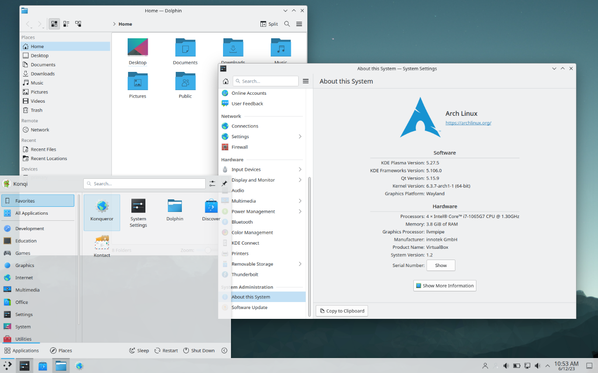

最近nixos-24.11正式发版, 自己的配置已经维持了两个月的稳定状态, 是时候做个milestone了, 毕竟一直用unstable总有种不够declarative的感觉. 成品截图放在这里.


## 窗口管理器

原本并没有用窗口管理器的打算, 最开始装Arch Linux的时候用的是KDE, 之前一直听说KDE更customizable, 工作上开发环境一直是ArchLinux配Gnome, 自己的电脑换换口味也无妨. 然而安装完之后, 第一印象就是朴素, 带有比较强的Windows风格, Gnome虽然也是在模仿MacOS的风格, 但相对来说更有自己的设计风格. 而且装了桌面环境就必须要接受大量默认的用不到的程序了, 我折腾的初衷还是希望有一个完全定制化的可控环境, 这点是不太能接受的.



接触[Hyprland](https://github.com/hyprwm/Hyprland)的契机是[ArchWiki desktop environment 中的custom environments章节](https://wiki.archlinux.org/title/Desktop_environment#Custom_environments), 可以比较直观的看到有桌面环境由哪些环境组成. Arch中可安装的WM的主页都浏览一遍的话, Hyprland显然是最华丽的一个, Wayland下流畅的动画与Tiling带来的纯键盘环境都是很attractive的feature, 窗口相关的透明度, 圆角, 阴影, 动画曲线等都是高度可自定义的(带透明和模糊的确实帅). Hyprland的配置文件格式也不算很复杂, 可以说是key可重复且不需要引号的json. 这里放一张我认为做的比较好看的配置, [来自unixporn](https://hyprland.org/videos/end_4_rice_intro.mp4).


实际上手过程中这类Tiling WM实际上对小屏很不友好, 特别是在我的mba上用[yabai](https://github.com/koekeishiya/yabai)的体验, 比较糟糕. 工作区的存在可以缓解这个问题, 但是同一个工作区窗口过少仍然是个问题. Gnome的插件[PaperWM](https://github.com/paperwm/PaperWM)很好的解决了这个问题, 各个窗口像屏幕一样水平或垂直铺开, 不再局限于屏幕大小. 基于这种思想衍生出了[niri](https://github.com/YaLTeR/niri)这个WM, 由于NixOS声明式的特点我想切换到niri是很简单的, 但是niri对我最看重的透明模糊处理的并不好, 好在有[hyprscroller](https://github.com/dawsers/hyprscroller)这个插件. 同样[从unixporn搬张图](https://www.reddit.com/r/unixporn/comments/1fpxitd/niri_a_gnome_user_tries_a_tilling_wm/)演示一下niri的效果.


不过题外话, Hyprland的作者[Varxy](https://blog.vaxry.net/)似乎比较神人, Freedesktop以他纵容Discord Hyprland频道中的恶劣氛围将他从中除名, 很多人也因为这点而拒绝使用Hyprland. Discord里各种俚语我不太看得懂, 但从他blog最近持续批判别的WM也可见一斑. 作为回应Varxy也另起炉灶, 不再依赖wlroots这一大部分wayland WM的核心组件, 确实是个技术强人.

## 状态栏

一个桌面环境只有窗口和壁纸的话表达的信息量还是太少了, 不管是Windows还是MacOS都有任务栏, 状态栏这样的设计, 瞥一眼就能知道系统的大概信息是很重要的.

我最初的选择是[eww](https://github.com/elkowar/eww), 主要受[这篇unixporn贴子](https://www.reddit.com/r/unixporn/comments/wosl44/bspwm_decided_to_finally_learn_how_to_use_eww/)的影响. 对我来说状态栏上的音乐播放状态与系统资源占用是比较重要的, 最后eww写出来的结果和开头展示的差不多. 但是eww最致命的一点就是他的配置语言一门作者自定义的叫做[yuck](https://github.com/elkowar/yuck.vim)的lisp方言, 简直就是括号地狱. 这里放一张之前说的eww贴子里的配置结果.


最后我还是决定迁移到[ags](https://github.com/Aylur/ags)上, 与eww相同都是基于gtk提供的css配置能力, 与其他五花八门的状态栏相比, 基于css的话自定义能力约等于无限. 同时, eww的yuck需要严重依赖bash脚本来实现很多功能, 很多状态的更新都通过轮询来实现, 而ags的配置语言是JavaScript/TypeScript这门Web上的绝对标准语言, 无论是本身的表达能力还是社区能提供的第三方库都远强于eww, 同时状态也可以实现阻塞式更新. 这里放一张[ags作者本人的配置](https://github.com/Aylur/dotfiles).


我的状态栏中icon, 工作区, 活动窗口哦都来自与ags本身提供的能力. ags的mpris协议不允许在没有音乐播放时使用默认的音乐信息, 所以音乐播放状态我这里通过[playerctl](https://github.com/altdesktop/playerctl)获取, 支持阻塞式的获取音乐状态. cpu资源占用需要使用python的[psutil](https://github.com/giampaolo/psutil)库, cpu使用率需要持续监测50ms, 而功耗占用需要通过采样`/sys/class/powercap/intel-rapl/intel-rapl:0/energy_uj`来计算(这个文件基于系统安全的考虑, 每次重启都会设置为包括root在内的所有用户不可读, 我这里通过启动脚本来在打开桌面时修改权限), 因此这两个数值的计算是异步的. nvidia显卡的占用情况通过nvidia-smi获取, amd核显则是rocm-smi.

这里吐槽一下, ags作者最近推出了[astal](https://github.com/Aylur/astal), 是进化版的ags, 支持通过任意语言利用html配置组件. 本来是好事, 但是ags作者发癫把ags v2改成了astal的typescript bundler, 和ags v1完全是不同的东西, tremendous breaking change! AUR那边似乎ags只有v2了, 所幸nixpkgs 24.11这边还是v1.

## 终端模拟器

终端反倒是最开始就定下来几乎没有变化, 用的是[kitty](https://github.com/kovidgoyal/kitty), 基于glfw实现opengl下的gpu加速. 对于终端其实美化的核心就是shell需要用到的几种颜色, 我这里的颜色衍生自[cyberpunck](https://github.com/cguiubg/kitty-cyberpunk)主题. 颜色的选取确实是rice过程中投入最大收益最高的过程, 每天用随机颜色生成器搞出无数个颜色, 最后确定下来之后之后所有rice组件的颜色都可以从这些基础色号里派生. 除此之外, kitty的tab功能我是很喜欢的, 两侧渐变的感觉很有设计感. 至于透明模糊这块, 似乎只有MacOS上的kitty可以在终端这边配置, Linux上需要依赖WM提供的功能(要是有的话可能我就换niri了). 这里放一张我写这篇文章时的kitty状态.


期间倒也尝试过别的终端. MacOS默认Terminal就不说了, 只支持16色, 否则还算好用. Alacritty是用rust写的, 但是第一次打开时那种糊成一片的感觉有点劝退, 似乎听说bug也略多. Rio是比较新的终端, 后端是WebGPU, 但是在我的mba上色彩空间转换竟然是错的, 线性颜色直接赋给拍P3色域上的值了. Warp比较特殊, 集成了ai功能, 是一个相对笨重的软件了, 也不支持tiling.

## 壳

或许shell叫命令行会更好? MacOS上比较常规, 是zsh; Linux上我用的是elvish, 用go编写, 不支持bash, 语法比较干净, 默认提供的功能用到的倒是不多, 主要用到支持基于已有输入上下键浏览历史, 但是虚拟文本不全命令是不支持的, 只是相比于前者不太重要. 和三大主流bash/zsh/fish比起来倒也没什么优势, 主要挺喜欢他的语法的(有种函数式的优雅), 标准库功能充足, bash历史的余韵太浓了. 这里放一下我的rc代码.

```elvish
fn ls {|@args|
  e:ls --color $@args 
}

fn ssh-agent {
  var set_ssh_env = {|env_cmd|
    use str
    var env_var env_prec = (str:split '=' $env_cmd)
    var env_val env_expt env_tail = (str:split ';' $env_prec)
    set-env $env_var $env_val
  }
  var auth_sock_cmd agent_pid_cmd echo_cmd = (e:ssh-agent)
  $set_ssh_env $auth_sock_cmd
  $set_ssh_env $agent_pid_cmd
}

var set-base-name = {|@args|
  e:kitty @ set-tab-title (basename (pwd))
}

var set-tab-title = {|@args|
  if (> (count $@args) 0) {
    e:kitty @ set-tab-title $@args
  }
}

set-env EDITOR nvim
set-env http_proxy 'http://127.0.0.1:7890'
set-env https_proxy 'http://127.0.0.1:7890'

if (==s $E:TERM 'xterm-kitty') {
  set edit:before-readline = [ $set-base-name ]
  set edit:after-readline = [ $set-tab-title ]
}

eval (starship init elvish)
```

至于prompt, Linux用的是starship, 配置基于toml, MacOS则是oh my posh, 配置基于json. 我其实更喜欢json, 配置结构一眼就能看出来, omp比较不能忍受的一点是unicode字符需要手动输入编码. 二者的表现力倒是差不多的, 我最开始是被starship的一种默认配置吸引, 自己的prompt也是基于这个配置, 图放在下面.


## 编辑器

对于代码工作这其实是核心, 别的都只是为了心情愉悦, 编辑器的好坏是直接影响生产力的.

与喜欢折腾的米娜桑一样, 我用的是neovim. 接触vim的契机是本科期间的linux编程课, 虽然只有短短4周, 但是linux中的shell, vim, gcc, 网络编程等方面都有涉猎, 也获得不少初级的实践经验, 算是linux启蒙了. 最开始我是在VS和VSCode中使用vim插件, 后面保研结束闲得没事干开始折腾nvim. 不得不说nvim以及各种插件的迭代确实是飞速, 一两年前的配置教程直接复制已经是不可用的了.

neovim的状态栏用的是[lualine.nvim](https://github.com/nvim-lualine/lualine.nvim), 同时自己实现了活动lsp以及通过lsp捕获当前所在scope的部分. 这里用rust演示状态栏的工作情况, 可以看到有当前模式, 光标位置, lsp, scope以及git branch. 关于scope这部分, `vim.lsp.buf_request_all`中的callback接口似乎文档有误, 文档中是`function(err, result, ctx)`, 实际则是`function(result)`.


为了不让底边栏过于臃肿, 文件名, lsp诊断与git状态我都挪到了右上角, 通过[incline.nvim](https://github.com/b0o/incline.nvim)实现. incline几乎没有提供任何封装, 渲染结果几乎只根据用户提供的字符串与高亮组来生成, 自由又原始.


对于编辑器中很常见的tab功能, 我使用的是[bufferline.nvim](https://github.com/akinsho/bufferline.nvim). 当然, buffer不是tab, 对于每个文件buffer是唯一的, neovim中的tab我不是很喜欢用, 我反而是用kitty的tab来做. 配置中buffer的顺序根据序号来排列, 而非打开顺序, 实际使用中倒也还好.


文件管理我原本是用[nvim-tree.lua](https://github.com/nvim-tree/nvim-tree.lua), 但是他的快捷键过于违反vim常识了, 我也不太需要file tree在侧边保持开启, 因此更换到了[oil.nvim](https://github.com/stevearc/oil.nvim/tree/master). oil.nvim支持直接通过buffer操作来管理文件系统, 无缝连接编辑与文件管理, 加速了我的工作区文件管理流程. 这个名字来自于[vim-vinegar](https://github.com/tpope/vim-vinegar)文档中的这么一段话: "项目文件树与分屏窗口就像油和醋一样不搭配." vim-vinegar以此为宗旨使得文件树直接出现在vim window中, 无需分离窗口, 同时可以像buffer一样编辑. 作为它的nvim版本, 自然是选用了oil这个名字. 这里放一张通过`:w`保存oil buffer后的界面, 这里的三个操作都是通过操作buffer完成的.


其余杂七杂八的插件按下不表, 实际上我这里并没有使用原生的lua来编写插件, 而是通过nixvim这个发行版来通过nix编写. 说是发行版, 但其实只是对各个插件的配置进行nix化, 使得nvim配置能和nix配置相互交融. nixvim中也可以写lua配置, 并且通过nixvim安装的nvim会检测nix文件中的lua配置并使用treesitter实现高亮, 不会像字符串那样只有一种颜色. 以下是treesitter示例, `.__raw`之后的都是lua代码, 第一段实现活动lsp检测, 第二段实现lsp scope检测.


可能会有人觉得在gui功能丰富且完善的今天使用vim是某种显得蛋疼的行为, 但vim带给我的最重要的资产其实是一种高效的编辑模式而非编辑器本身, 各个主流gui编辑器/IDE都可以通过vim模式来编辑, 不需要再单独学习各类快捷键操作, 这是受益终身的.

## 发行版

发行版我放到最后来讲, 虽然以上种种都需要依赖某种Linux发行版来作为运行的基础, 但各大发行版实际上大同小异, 更多的是包格式与软件源上的差别.

我最开始是用ArchLinux的, 与在公司的工作流一致. 都说Arch难, 实际上比较弱智的包管理机制, 内容详实的ArchWiki和拥有几乎一切软件的AUR对想要对系统做出一些改动的用户来说是非常友好的, 我的这些rice也基本都在Arch上就完成了整体框架.


后来更换发行版的契机其实就是配置文件的管理, 原本我是通过git orphan branch来分别存储各个软件的配置文件, 维护多个分支是相对麻烦的一件事, 如果要在别人的系统上复现也不太友好. 同时Arch的滚动更新的特性导致某个软件一旦出现bug就需要自己想办法去修复, 尽管可以安装旧版本但在pacman下是比较危险的.

以此为目的我开始使用NixOS并把配置迁移为Nix语言, 中途也经历了一次重装系统, Nix非常完美的复现了重装之前的配置, 软件出现bug时也可以轻松回滚. Nix是利用纯函数式语言来实现精确的包构建的包管理器, 实际上不依赖NixOS, 但是在NixOS上可以实现系统配置的可复现. 其实对于我一开始管理配置文件的需求, 只需要home-manager即可, 但为了最完美的匹配Nix最终还是成为了一名NixOS的忠实用户.


Nix的包都通过nixpkgs这个仓库来管理, 有滚动的unstable分支, 每半年会branch出一个稳定版, 比如最新的24.11. nixpkgs每次发版的代号都是某种动物, 24.11的代号就是Vicuña, 即羊驼. 在直到写这篇博客的一天之前我都是unstable的用户, 但是最近ags的breaking change让我坚定了成为稳定版钉子户的决心, 保卫我维护了一年的配置.


在容器化大行其道的今天, Nix这套复现整个系统的方法显得过于笨重了, 学习曲线也较为陡峭. 但作为一个工作流已经稳定的个人用户, 稳定压倒一切, NixOS就是最适合我的发行版.

## 结语

折腾配置的这一年还是很开心的, 有一种从0开始掌控计算机的快感, 不过折腾之外的代码倒是没写多少. 这和工作有关, 已经不是学校里随时随地写自己喜欢的代码的人了, 当然目前工作的内容我还是很喜欢的. 现在pbrt已经读到采样重建的章节了, 希望再过几个星期读完之后可以在2025年内写一个新的Vulkan渲染引擎, 用现在的这套工作流实现一些我觉得很cool的feature.
